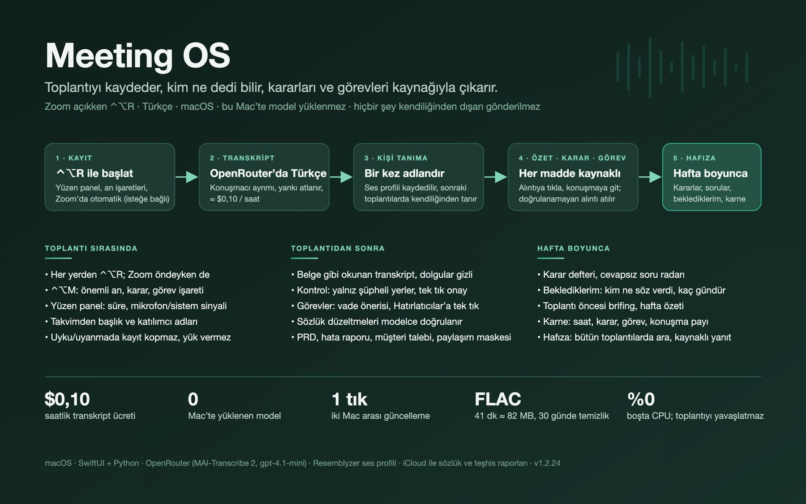

# Meeting OS — yerel toplantı hafızası

Mac uygulaması ve CLI: ayrı mikrofon/sistem sesi, toplantı bitince OpenRouter’da
Türkçe transkript ve konuşmacı ayrımı, kalıcı ses profilleri. Özet, karar, risk,
açık soru ve görev çıkarımı; kendi görev kuyruğu; kaynaklı arşiv araması ve görev
taslakları. Varsayılan yol buluttur (ücretli OpenRouter API’si); bu Mac’te model
yüklemek için Ayarlar → Sistem → Yazıya çevirme → Yerel model seçilir. Otomatik
dış servis aksiyonu yoktur.



Tam kullanım kılavuzu: [docs/KULLANIM.md](docs/KULLANIM.md) (bütün özellikler, sekmeler, ayarlar, kısayollar, sınırlar).

Ekibe yeni katılan biri için tek sayfalık başlangıç: [docs/EKIP.md](docs/EKIP.md) — `git clone -b v0.1 … && sh scripts/install.sh` ile kurulum, gizlilik, ilk gün ve ilk hafta.

## Bu Mac’te aç

**`Meeting OS.command` dosyasını çift tıklayın.** Uygulama henüz yoksa ilk kurulumu
başlatır; kuruluysa uygulamayı açar. İlk kurulumda araçlar ve modeller indirilir.
Homebrew veya Apple geliştirici araçları eksikse kurucunun gösterdiği adımları
tamamlayın. Gerekirse aynı dosyayı tekrar açın. Hata ayrıntısı `installation.log`
dosyasına kaydedilir. Kurulu uygulama ayrıca `build/Meeting OS.app` içindedir.
Gerçek dosyalar `~/Library/Application Support/MeetingOS/` altında bulunur.
Codex çıktısındaki `meeting-os-local` bağlantısı proje klasörünü açar.

1. Toplantı adını yazıp **Yeni kayıt** seçin. İlk kullanımda macOS’un mikrofon
   ve ekran/sistem sesi izinlerini onaylayın. İzinler gerekirse **System Settings
   → Privacy & Security → Microphone / Screen & System Audio Recording** içinde
   **Meeting OS** için açılır. İzin değişikliğinden sonra uygulamayı yeniden açın.
2. Mikrofon ve sistem sesi ayrı WAV dosyalarına kaydedilir. Bulut modunda kayıt
   sırasında canlı metin yoktur; metin, isimler ve özet kayıt bitince gelir.
3. **Kaydı bitir** sesi kapatır ve parçaları OpenRouter’a gönderir; nihai transkript
   oradan döner. Yerel modeldeyseniz aynı metin bu Mac’te üretilir. Ses kurtarma
   için korunur.
4. Nihai metinde bir bölümü dinleyip **Düzelt** seçin. Metni veya konuşmacı adını
   değiştirebilirsiniz. Özgün metin ve düzeltme geçmişi korunur.
5. **Özet** ekranında her maddenin kaynak alıntısını kontrol edin.
   Kayıt son işlemi ve dosya içe aktarımı bittiğinde özet/görev analizi OpenRouter’da (gpt-4.1-mini) otomatik başlar; yerel modda bu Mac’te çalışır.
   İsim/metin düzeltince analiz eski işaretlenir; Özet sekmesinin sağ üstündeki
   **Özeti güncelle** ile yenileyin.
6. Aynı kişinin sonraki toplantılarda tanınması için temiz, tek konuşmacılı bir
   bölümü dinleyin; **Düzelt → Gelişmiş** altındaki “Dinledim: en az 6 saniye, tek
   kişi, temiz ses” kutusunu işaretleyip **Adlandır ve öğren** seçin. İsim
   düzeltmek tek başına profil eğitmez. Gürültülü,
   çakışan veya kısa bağlamlı örnekler reddedilir. Aynı adlı farklı kişilere
   ayırt edici adlar verin. Belirsiz eşleşmeler isimsiz kalır.

Ayarlar (⌘,) → Sistem → **Yazıya çevirme** seçimi varsayılan olarak OpenRouter’dır: kayıt bitince ses seçili modele gönderilir, bu Mac’te model yüklenmez, konuşmacı ayrımı sağlayıcıdan gelir (varsayılan **Microsoft MAI-Transcribe 2**, ≈ $0,10/saat). Bu modda kayıt sırasında canlı metin yoktur. Bitmemiş kayıtlar toplantının üstündeki kurtarma şeridinde **Bulutta yazıya çevir** ile gönderilir. Kayıtlı ses dosyaları kenar çubuğundaki **⋯ → Ses dosyası aç…** ile yazıya çevrilir; yerel
`import` yolu yalnız CLI’de durur, kenar çubuğunda düğmesi yoktur.
Bir toplantıyı silmek için listede sağ tıklayıp **Toplantıyı sil…** seçin veya
başlıktaki çöp kutusunu kullanın; onaydan sonra transkript, düzeltmeler, özet,
görevler ve toplantıya ait ses klasörü silinir, ses profilleri korunur. Üzerinde iş
süren toplantı silinemez. Arama seçili toplantının metnini ve konuşmacılarını
filtreler. Markdown, SRT ve JSON dışa aktarımı vardır; JSON export ses vektörlerini
içermez. **Sesler ve sözlük** bölümünde kişi adlarını ve PM terimlerini
satır satır ekleyebilir, kaydedilmiş profilleri silebilirsiniz.

## Güncelleme ve iki Mac arası akış

Uygulama GitHub `v0.1` dalını açılışta ve 6 saatte bir kontrol eder; yeni sürümde kenar çubuğunda **Güncelle ve yeniden başlat** kartı çıkar (Ayarlar’dan otomatik güncelleme açılabilir). Güncelleme uygulama kapalıyken `scripts/update.sh` ile çekilir, aynı imzayla derlenir ve yeniden açılır; macOS izinleri korunur. Her toplantıdan sonra teşhis raporu iCloud Drive `MeetingOS-Reports/<mac>` klasörüne yazılır; geliştirme Mac’inde `reports summarize` bunları özetler. Ayrıntı: `docs/TWO_MAC_WORKFLOW.md`.

## Günlük kullanım kısayolları ve kontrol

- **Menü çubuğu simgesi** (dalga) her uygulamanın üstünde: tek tıkla kayıt başlat/bitir, süre, an işaretleri, Kontrol’e geç. **⌃⌥R** ve **⌃⌥M** sistem geneli kısayollardır; Zoom öndeyken de çalışır, Erişilebilirlik izni gerektirmez. Zoom toplantı penceresi açıkken simge ve kenar çubuğu bunu belirtir.
- **⌘R** kaydı başlatır/bitirir. Kayıt sırasında **⌘M** önemli an, **⌘⇧M** karar, **⌘⌥M** bana görev, **⌘⌃M** sonra bak işareti koyar; işaretler kayıt bitince Kontrol sekmesinin en üstünde ve ilgili paragrafta görünür.
- **Kontrol** sekmesi bütün metni okumak yerine şüpheli yerleri sıralar: onay bekleyen isim (“Sol Üst?” → Onayla), isimsiz konuşmacı, çakışan konuşma, kısa sesle tanıma, sahibi belirsiz görev. Altında **Adlandırma isabeti** satırı (otomatik doğru/yanlış, öneri onay/red, kaçırılan, metin düzeltmesi) ve onun altında haftalık **Öğrenme** satırı (bu haftaki kendiliğinden tanıma oranı, önceki hafta, 1000 kelimede düzeltme) vardır.
- **Okuma görünümü** aynı kişinin ardışık bölümlerini paragraf yapar, “hı hı/tabii” araya girişlerini katlar, dolgu seslerini gizler (kapatılabilir). **Bölümler** ham kayıtları gösterir.
- **Ayarlar → Sistem → Gelişmiş → Eski sesleri temizle:** 30/60/90/180 günden eski, tamamlanmış toplantıların yalnız ses dosyalarını siler; transkript, özet, görevler ve profiller kalır. Önce silinecekler listelenir; “Sesi koru” işaretli toplantılara dokunulmaz.
- **Dışa aktar → Belge hazırla (bulut):** toplantıdan PRD, hata raporu, müşteri talebi veya Claude Code istemi; bilinen/eksik ayrımı, kaynak bölümler, kaynakta olmayan sayı reddi. **Dışa aktar → Paylaş…** isim maskeleme ve yalnız kararlar seçenekleriyle önizleme.
- **Görevlerim:** önceki toplantıdaki benzer görev gösterilir, “Aynı görev, eskisini kapat” ile bağlanır; Özet’te kararların önceki hâli listelenir. **Gün sonu özeti…** yalnız sana düşenleri toplar.
- **Düzelt → Neden bu isim?** ses profili puanlarını ve eşikleri gösterir; Ayarlar’da kişi başına örnekler silinebilir, isimler birleştirilebilir.
- **Görevlerim → Sonraki toplantı gündemi…** son 5 toplantının açık görev, soru ve kararlarından kaynaklı bir Markdown taslak kaydeder; hiçbir yere gönderilmez.
- **Görevlerim → Gün sonu özeti…** o gün kaydedilen toplantılardan yalnız sana düşenleri kaydeder: verdiğin sözler (sahibi siz olan görevler), senden beklenen cevaplar (açık sorular), alınan kararlar ve toplantı listesi; her madde `Kaynak #` alıntısıyla gelir. CLI: `digest --day 2026-09-09 --output ozet.md`.
- **Haftalık paydaş raporu:** aynı özet bir tarih aralığına genişler. `digest --from 2026-09-01 --to 2026-09-07 [--mask-names] --output hafta.md` dönemdeki her toplantıyı yeniden eskiye sıralar ve her biri için kararlar, riskler, cevapsız sorular, o dönemde kapanan görevler ve hâlâ açık görevler başlıklarını verir; `--mask-names` Paylaş’taki maskelemeyi kullanır (kayıtlı veri değişmez).
- **Beklediklerim:** sahibi sen olmayan (ve sahibi boş olmayan) açık görevler kişi kişi listelenir; her madde yaşı (gün), toplantısı, ilk `Kaynak` alıntısı ve aynı iş ≥2 toplantıda geçiyorsa TEKRAR EDEN işaretiyle gelir. Kişi başına kopyalanabilir kibar bir hatırlatma taslağı hazırlanır — hiçbir yere gönderilmez. CLI: `waiting [--output bekleyenler.md]`.
- **Karar günlüğü:** bütün toplantıların en güncel analizindeki kararlar tek listede, yenisi üstte; her kararın kaynağı ve varsa önceki toplantılardaki benzer hâlleri gösterilir. CLI: `decisions [--query metin] [--mask-names] [--output kararlar.md]`.
- **Gözden geçirme borcu:** son N günde kaydedilen tamamlanmış toplantıların Kontrol kuyrukları tek listede, önce en ağır madde. CLI: `review-debt --days 7`.
- **Dışa aktar → Paylaş…** paylaşmadan önce önizleme gösterir: **İsimleri maskele** konuşmacı adlarını ve sözlükteki `kişi` girdilerini dışa verilen metinde “Kişi A, Kişi B…” yapar (kayıtlı veri değişmez), **Yalnız kararlar** sadece karar bölümünü bırakır, **Transkripti dahil et** kapatılabilir. CLI: `share --meeting ID --mask-names --only-decisions --output paylasim.md`.
- Kayıt sırasında ekran uykusu engellenir (sistem sesi yakalama ekran uyuyunca düşer). Mikrofon hoparlör yankısı yüklenmeden atlanır.
- CLI: `quality report` (düzeltmelerinizden WER ve kimlik karnesi), `quality compare --model … --allow-upload` (modelleri kendi düzeltmelerinize karşı ölçer), `agenda --output gundem.md`.

## Proje sözlüğü (terimler, kısaltmalar, isimler)

İçe aktarılan sözlük `iCloud Drive/MeetingOS-Shared/glossary.jsonl` dosyasına yazılır ve bütün Mac’lerde okunur (Ayarlar → Sesler ve sözlük → **glossary.jsonl içe aktar…**, veya CLI `glossary import dosya.jsonl`); `~/Library/Application Support/MeetingOS/glossary.jsonl` varsa Mac’e özel ek/üstüne yazma olarak önce okunur. Git deposuna girmez. iCloud Drive tek Apple Kimliğine bağlı olduğu için ekip için Ayarlar → Sesler ve sözlük → **Ekip klasörü** vardır: ortak klasör seçilince sözlük `<ekip klasörü>/glossary.jsonl` ile birleştirilerek okunur/yazılır (yerel dosya önceliklidir, ekip dosyası yalnız eksikleri tamamlar) ve teşhis raporları kişisel klasör yerine `<ekip klasörü>/reports/<mac-adı>/` altına yazılır. Ses, transkript ve ses profilleri bu klasöre girmez. Her satır bir JSON nesnesi:

```
{"term":"PMD","expansion":"Product Management Daily","category":"kısaltma","aliases":["pi em di"],"mishearings":["pemede","PMB"],"context":"ürün ekibinin günlük toplantısı","confidence":"yüksek","source_count":14}
```

Zorunlu alan yalnız `term`; `category` kısaltma | ürün | proje | ekip | kişi | teknik terim | müşteri | jargon. `vocabulary.txt` satırları da sözlüğe dahil edilir. Kullanım: (1) prompt kabul eden bulut STT modellerine yazım ipucu (GPT Transcribe ailesi; 9 Eylül A/B ölçümünde OpenRouter üzerinden ölçülebilir etki görülmedi, MAI ipucu almıyor); (2) transkript bitince yerel benzerlik taramasıyla “pemede → PMD” gibi öneriler Kontrol sekmesine düşer, **Sözlükle tara** bulut modunda önerileri gpt-4.1-mini’ye doğrulatır, **Uygula** metni düzeltir (özgün metin ve düzeltme geçmişi korunur), **Doğrulananları uygula** modelin kabul ettiği önerilerin hepsini tek seferde işler, **Yoksay** öneriyi metne dokunmadan düşürür; (3) özet/görev analizine sözlük bağlamı gider, kısaltmalar açık yazılır. Ham transkript kendiliğinden değiştirilmez.

Slack agent için istem `docs/GLOSSARY.md` içindedir.

## Özet, görevler ve hafıza

**Görevlerim**: Size atanmış, bu toplantıya ait veya bütün görevleri görün.
Başlık/sahip/tarihi düzenleyin; Açık / Devam ediyor / Tamamlandı / Kaldırıldı
seçin. Yeniden analiz elle düzenlemeleri ve görev durumunu sıfırlamaz. Sonraki
analizin desteklemediği görevler güncel değil diye işaretlenir; silinmez.
Belirsiz sahiplik boş bırakılır. Tarihler kayıtta söylendiği gibi gösterilir;
“yarın” otomatik takvim tarihine çevrilmez. İsimlerin doğru olması görev
sahipliğinin doğruluğunu etkiler.

**Taslak hazırla** yalnızca seçilen görevin kanıtlarını kullanarak bu Mac’te
incelemeniz için metin üretir. Taslak öneridir; gerçek dünya işi tamamlanmış
sayılmaz. **Codex / Claude Code / ChatGPT için paket kaydet** kaynaklar, görev ve
varsa güncel taslağı bir Markdown dosyasına yazar. Hiçbir agente kendiliğinden
mesaj göndermez veya iş başlatmaz. Başka uygulamaya dosyayı verdiğinizde o
uygulamanın veri politikası geçerlidir. Codex ve Claude abonelikleri API
kredisi olarak kullanılmaz.

**Hafıza** tüm tamamlanmış toplantılarda anahtar kelime arar. **Kayıtlardan
yanıtla** en fazla 12 ilgili bölümle yerel, alıntılı bir yanıt üretir. Yeterli
kaynak yoksa yanıt vermekten kaçınır. Arama sözcük tabanlıdır; anlamca benzer
ama farklı kelimelerle yazılmış bütün kayıtları bulma garantisi yoktur.

**Dışa aktar → Özet ve görevler** paylaşmaya hazır yerel Markdown üretir.
Salt okunur MCP bağlantısı için [V1 kullanım rehberi](docs/V1_USAGE.md).

## Model seçimi ve ölçülmüş kalite

Varsayılan yol **bulut** (1.2.x, 9 Eylül 2026 kararı): bu Mac’te model yüklenmez, toplantı sırasında yük yoktur.

- Transkript ve konuşmacı ayrımı: **OpenRouter · `microsoft/mai-transcribe-2`** (Opus 32 kbps parçalar, ≈ $0,10/saat; mikrofona düşen hoparlör yankısı yüklenmeden atlanır).
- Özet / karar / görev: **OpenRouter · `openai/gpt-4.1-mini`**; kaynak alıntıları yerelde doğrulanır, doğrulanamayan atılır.
- Kalıcı kişi eşleştirme: **Resemblyzer** (tek yerel model, hafif), model sürümüne bağlı SQLite profilleri; eşikler 0,87 / marj 0,05 / öneri 0,83 / otomatik örnek 0,93; `quality replay` ile regresyon (gerçek veri: 16 küme, 14 doğru, 0 yanlış, 2 atlanmış).
- Yerel yol (MLX Whisper, sherpa-onnx, Silero VAD, Qwen3-4B MLX) CLI’de durur; uygulama artık kullanmaz.

M4 / 16 GB üzerinde 12 Türkçe insan okuma kaydında kelime hata oranı büyük
modelde **%8,2**, turbo modelde **%11,9** ölçüldü. Bu küçük set gerçek toplantı
kalitesini kanıtlamaz. Türkçe/İngilizce sentetik geçiş örneği, gerçek ses kimliği
ve konuşmacı testleriyle birlikte tüm kapsam/sınırlar [VALIDATION.md](docs/VALIDATION.md)
içindedir. 3–5 kendi toplantınız için [benchmark rehberi](docs/BENCHMARK.md) ve
`benchmarks/manifest.example.json` hazırdır.

## Kayıt güvenliği ve sınırlar

Ses kaydedici transkripsiyondan bağımsız çalışır, kapanmış WAV parçalarını kendi
kalıcı günlüğüne yazar. Python işlemi kesilse bile tamamlanmış ses parçaları
**Son transkripti oluştur / Kurtar** ile işlenebilir. Ani sistem kapanışında henüz
kapanmamış son parça kurtarılamayabilir. Uygulamadan normal çıkış, sürmekte olan
kaydın kapanmasını ve son işlemin tamamlanmasını bekler.

Arayüzde kayıt üst sınırı 4 saattir. WAV kayıt yaklaşık 2 GB/saat alan
kullanabilir; boş disk alanını buna göre ayırın. Kaydedici 1,2 GB altında
başlamaz, yaklaşık 1 GB kaldığında kapanmış parçaları koruyarak durur. Kulaklık kullanımı önerilir:
akustik echo cancellation yoktur; hoparlör sesi mikrofona geri girerse çift
metin/konuşmacı karışıklığı olabilir. Diğer uygulamaların sistem sesi de alınır.
Ekran kareleri saklanmaz. Çakışan konuşmaların tüm kelimelerini kurtarma,
Bluetooth/uyku/ekran kilidi sonrası kesintisizlik ve uzun cihaz kaydı henüz
kanıtlanmış değildir. İlk macOS izin penceresi kullanıcı etkileşimi gerektirir;
bu pencere otomasyonla geçilmedi.

## CLI

Proje klasöründen:

```sh
.venv/bin/python -m meeting_os doctor
.venv/bin/python -m meeting_os record /local/path/toplanti --live --seconds 3600
.venv/bin/python -m meeting_os finalize /local/path/toplanti --title 'Sprint planlama'
.venv/bin/python -m meeting_os import /path/meeting.m4a --title 'Görüşme'
.venv/bin/python -m meeting_os meetings
.venv/bin/python -m meeting_os show MEETING_ID
.venv/bin/python -m meeting_os label-segment MEETING_ID SEGMENT_ID 'İpek'
.venv/bin/python -m meeting_os enroll MEETING_ID SEGMENT_ID 'İpek' --confirmed-clean
.venv/bin/python -m meeting_os profiles
.venv/bin/python -m meeting_os analyze MEETING_ID
.venv/bin/python -m meeting_os actions --owner "Adınız"
.venv/bin/python -m meeting_os prepare TASK_ID
.venv/bin/python -m meeting_os handoff TASK_ID /local/path/task.md
.venv/bin/python -m meeting_os ask "onboarding PRD"
.venv/bin/python -m meeting_os benchmark benchmarks/manifest.example.json --output /local/path/results
```

Varsayılan DB `~/Library/Application Support/MeetingOS/meeting-os.sqlite`.
İzole test için `--db /local/test.sqlite` seçeneğini **alt komuttan önce** verin.
`transcribe --help` model/motor/dil/eşik seçeneklerini gösterir. `--language auto`
çok dilli başlangıç algılar; `tr` Türkçe ağırlıklı toplantılar içindir ve İngilizce
kelimeler transcribe edilir, çeviri yapılmaz. `vocabulary.txt` bir ipucudur;
isimlerin kesin yazılmasını garanti eden otomatik değiştirme listesi değildir.

## Başka bir Mac / yeniden kurulum

Kaynak: <https://github.com/borankaraduman-star/meeting-os> — en son sürüm ZIP’i ve SHA256 toplamı
<https://github.com/borankaraduman-star/meeting-os/releases/latest> adresinde. Git ile:

```sh
git clone -b v0.1 https://github.com/borankaraduman-star/meeting-os.git ~/meeting-os
sh ~/meeting-os/scripts/install.sh
```

`scripts/install.sh` eksik araçları kurar, `scripts/setup.sh` ile ortamı hazırlar, adınızı ve OpenRouter anahtarınızı sorar, `doctor` ile bitirir; tekrar çalıştırılabilir. `Meeting OS.command` çift tıklanınca uygulama kuruluysa açar, değilse aynı betiği çağırır.

Uygulama sabit bir kod imzasıyla derlenir, bu yüzden kurulum **iki kez parola sorar**: (1) Mac’te hiç kod imzalama
sertifikası yoksa betik “Meeting OS Local” adıyla kendinden imzalı bir tane oluşturur ve macOS penceresinde ona
güvenmek için parola ister; (2) terminalde, imzalama anahtarına kalıcı izin vermek için (`security
set-key-partition-list`). İkinci adım sertifikanın nereden geldiğine bakmaksızın her kurulumda çalışır ve giriş
(login) anahtar zincirindeki bütün imzalama anahtarlarına uygulanır. Atlanırsa her derleme ve her güncellemede
“codesign anahtarı kullanmak istiyor” penceresi çıkar ve “Her Zaman İzin Ver” tutmaz; o durumda bir kez
`sh ~/meeting-os/scripts/fix-signing-prompts.sh` çalıştırın. Başarılı olunca
`~/Library/Application Support/MeetingOS/signing-partition.ok` yazılır; `scripts/update.sh` ve `doctor` buna bakar.

macOS 15+, Apple Silicon, Xcode Command Line Tools, Python 3.12 ve ffmpeg gerekir.
ZIP kullanıyorsanız açıp kaynak klasörünü iCloud dışında yerel bir dizine yerleştirin.
Yeni Mac’te OpenRouter anahtarı kurulum sırasında sorulur; sonradan girmek için uygulamada
**Ayarlar (⌘,) → Sistem → OpenRouter anahtarı** satırını kullanın (anahtar o Mac’in `openrouter.key`
dosyasında ve yedek olarak Anahtar Zinciri’nde kalır); ses profilleri ve toplantılar Mac’e özeldir,
taşınmaz.
`Meeting OS.command` dosyasını çift tıklayın; eksik Homebrew/Python/ffmpeg araçlarını
kurmaya yönlendirir ve ardından `scripts/setup.sh` çalıştırır.
macOS indirilen dosyayı engellerse Sistem Ayarları → Gizlilik ve Güvenlik içindeki
uyarıyı inceleyin; bu paket Apple tarafından noterlenmiş bir kurucu değildir. Kurulum paketleri ve ücretsiz modelleri indirir; inference sesinizi
yüklemez. Test edilmiş paket sürümleri `requirements-macos-tested.txt` içindedir.
Bu Mac’in bağımsız Python tabanı `MeetingOS/python-3.12`, ortamı
`MeetingOS/runtime-v0.1` altında; Codex önbelleğine bağımlı değildir.

```sh
.venv/bin/python -m unittest discover -s tests -v
.venv/bin/python scripts/stress-capture.py
scripts/build-capture.sh
scripts/build-desktop.sh
```

Uygulama yerel ad-hoc imzalıdır; başka Mac’lere notarize edilmiş tek dosya
kurulum paketi değildir. App bundle bu yerel çalışma ortamını kullanır; proje ve
runtime klasörlerini silmeyin. Veri/üçüncü taraf kaynakları
[THIRD_PARTY.md](docs/THIRD_PARTY.md) içindedir.

CPU Whisper karşılaştırma ağırlığı disk alanı için kaldırılmıştır; sonuçları
korunur ve `models fetch whisper-turbo` ile yeniden indirilebilir. Canlı/nihai
MLX, konuşmacı ve yerel analiz modelleri bu Mac’te hazırdır.

## 1.0.3 bellek koruması

16 GB Mac için canlı ve nihai transkript varsayılanı `mlx-turbo` oldu. Büyük
Whisper modeli 32 GB altında yüklenmez. Bu bir hız/bellek–doğruluk tercihidir;
büyük modelle aynı doğruluk garanti edilmez. MLX önbelleği 64 MB ile sınırlandı.
Uygulama kendi işinin fiziksel bellek kullanımını ve macOS bellek uyarılarını
izler; kaynak baskısında işi durdurur. Kayıt sürüyorsa önce normal kapanış ister;
hâlihazırdaki model çağrısı dönerken gecikme olabilir. İşletim sistemi veya diğer
uygulamaların neden olduğu tüm bellek sorunlarını engelleme garantisi değildir.

## 1.0.4 kurulum ve kayıt durdurma

Standart kurulum artık yalnızca turbo STT, konuşmacı ve yerel özet modellerini indirir; büyük Whisper isteğe bağlı benchmark modelidir. Hugging Face CAS/Xet varsayılan olarak kapalıdır, HTTP indirme zaman aşımı 120 saniyedir. Hesap/token zorunlu değildir; açıkça ayarlanmış ortam değişkenleri korunur. Bu ayar tüm ağ hatalarını önleme garantisi değildir.

Kayıt yardımcısı durdurma sinyalinden sonra 15 saniye içinde kapanmazsa uygulama kendi yardımcısını sonlandırır ve kaydı eksik olarak işaretler. Tamamlanmış ses parçaları ve günlük korunur. Hâlen çalışan native model çağrısının iptali ayrı bir sınırlamadır; bu sürüm onun için kesin bir zaman garantisi vermez.

Güncel kalite döngüsü ve kalan kabul testleri: [ITERATION_CHECKPOINT](docs/ITERATION_CHECKPOINT.md).

## 1.0.5 — 16 GB Mac için transkripsiyon

`--engine auto` varsayılandır. 16 GB ve altı Mac'lerde quantize turbo whisper.cpp, GPU kapalı ve iki CPU iş parçacığıyla çalışır. Kurulum uygun modeli ve sabit sürümlü whisper.cpp derlemesini hazırlar. Özel model yolu verirken `--engine mlx`, `cpp` veya `whisper` belirtin.

Ağır komutlar ayrı süreçlerde bellek baskısı ve süreç grubu belleği izlenerek çalışır. Örneklemeli koruma her işletim sistemi arızasını önleme garantisi değildir. Canlı metin ayrı işçilerde üretilir; ana süreç ölürse ses yakalama ve model süreçleri arkada bırakılmaz. Tamamlanmış ses parçaları korunur.

Kapak kapalıyken dahili mikrofon donanımsal olarak kapanır; uygulama bu durumu gösterir. Kapağı açın veya harici mikrofon kullanın.

16 GB Mac'te özet/görev analizi otomatik başlamaz; Analiz sekmesinden isteğe bağlı çalıştırılır ve bellek korumasına tabidir. Bu bilgisayarın mevcut yükünde büyük özet modeli bellek baskısına takıldı; küçük model kalite testini geçmediği için varsayılan yapılmadı.

[Bu Mac'te ölçülen sonuçlar](docs/RELIABILITY_1.0.5.md).

### OpenRouter transkripsiyonu (varsayılan yol)

Kenar çubuğunda **⋯ → Ses dosyası aç…**, kullanıcı onayıyla varsayılan `microsoft/mai-transcribe-2` veya model menüsündeki doğrulanmış alternatifleri kullanır. Bu ücretli bulut yolu varsayılandır. Anahtar macOS Anahtar Zinciri’nde tutulur; konuşmacı ayrımı sağlayıcıdan gelir, özet/görev analizi de OpenRouter’da (gpt-4.1-mini) yapılır; yalnız ses profili eşleştirmesi bu Mac’te kalır. Kurulum, fiyat, devam etme ve doğrulama sınırları: [OpenRouter rehberi](docs/OPENROUTER.md).

### Toplantı sırasında yük (1.2.14+)

Uygulama toplantıyı hiçbir zaman yavaşlatmamalı. Bunun için: kayıt işi normal öncelikte kalır, diğer bütün işler (yükleme, kişi tanıma, analiz, belge) düşük öncelikte (`utility`) çalışır; ekranda Zoom toplantı penceresi varsa en düşük öncelikte (`background`), Python tarafı `nice 10` ve tek yükleyici ile. Zoom açıkken güncelleme başlatılmaz (düğme “Güncelleme toplantı bitince” olur; otomatik güncelleme de bekler); güncelleme betiği derlemeyi ve pip’i `nice 19` ile koşar. Uygulama boştayken durum yoklaması 2 sn yerine 6 sn’de bir. Her tamamlanan işin CPU saniyesi, tepe belleği ve süresi toplantı metadata’sına (`job_usage`) ve iCloud raporuna yazılır; “yavaşladı” şüphesinde önce oraya bakın. Yükleme ağı hafiftir: parçalar Opus 32 kbps (saatte ≈14 MB).

### Kurulum durumu (ikinci Mac için)

Ayarlar sayfasının başındaki **Kurulum durumu** kartı mikrofon, ekran kaydı, takvim, hatırlatıcı ve bildirim izinlerini, OpenRouter anahtarının Keychain’de olup olmadığını (değer okunmaz, yalnız varlık), sözlük terim sayısını/paylaşımını ve sürümün güncel olup olmadığını tek listede gösterir. Kırmızı madde: kayıt ya da güncelleme onsuz çalışmaz; gri: isteğe bağlı.

### Klavye kısayolları

Her yerden: ⌃⌥R kaydı başlat/bitir, ⌃⌥M önemli an. Uygulama içinde: ⌘1 Transkript · ⌘2 Özet · ⌘3 Görevlerim · ⌘4 Kontrol · ⌘5 Hafıza (Git menüsü), ⌘F konuşmada ara, ⌘⇧F hafızada ara, ⌘, Ayarlar, Esc aramayı temizler. Kayıt sırasında ⌘⇧M karar anı, ⌘⌥M görev, ⌘⌃M sonra bak.

### Toplantı öncesi brifing (1.2.23+)

Görevlerim → **Brifing…**: takvim bağlamı açıksa sıradaki (ya da süren) takvim etkinliğinin katılımcılarını alır; yoksa seçili toplantının takvim katılımcılarını kullanır. Her kişi için verdiği açık sözler, birlikte olduğunuz toplantılardan açık sorular ve kararlar, son görüşme; sonunda sizin açık görevleriniz. Markdown olarak kaydedilir, hiçbir yere gönderilmez. CLI karşılığı yok; `brief` köprü eylemi.

### Vade önerisi (1.2.22+)

Görevlerim’de transkriptte geçen zaman ifadesi (“yarın”, “haftaya salı”, “ay sonu”, “15 Eylül”, “3 gün içinde”…) toplantı tarihine göre bir takvim gününe çevrilir ve **Öneri: 15 Eyl · Onayla** olarak gösterilir. Onaylanmadan hiçbir yere yazılmaz; belirsiz ifadeler (“en kısa zamanda”) için öneri çıkmaz. Onaylanan tarih görevde saklanır, “Hatırlatıcılar’a ekle” o gün 09:00 alarmıyla gönderir; geçmiş tarihli açık görevler turuncu görünür. CLI karşılığı yok; `intelligence` köprü yanıtındaki `due_suggestions` ve `task_set_due` eylemi.

### Görevleri Apple Hatırlatıcılar’a gönderme

Görevlerim’de her görevin yanında **Hatırlatıcılar’a ekle**: görev varsayılan Hatırlatıcılar listesine başlığıyla eklenir; notunda kaynak toplantı, sahip ve transkriptteki zaman ifadesi bulunur (tarih tahmin edilmez). İlk kullanımda macOS Hatırlatıcılar izni istenir.

### Hafıza araması ve Türkçe ekler

“Ara” ve “Kayıtlardan yanıtla” yerel sözcük eşlemesiyle en fazla 12 alıntı seçer, yanıtı bulut analiz modeli yazar. Eşleme Türkçe eklere dayanıklıdır (“modülleri” → “modülü”, “eğitim” → “eğitimlerinin”): kısa ortak kök tam eşleşmeden biraz düşük puan alır; “ve, kaç, mi, hakkında” gibi işlev sözcükleri sorudan atılır. 9 Eylül ölçümü: “modüller kaç günde tamamlanıyor” sorusu düzeltmeden önce kanıtı kaçırıyordu, sonra 3 kanıtla tam yanıt verdi.

### Uyku, uyanma ve akış hatası (1.2.18+)

Kayıt yardımcısı ScreenCaptureKit akışı durursa (uyku/uyanma, ekran değişikliği) ya da 20 saniye hiç ses gelmezse akışı kendiliğinden yeniden kurar (en çok üç deneme; günlükte `restarting`/`restarted` olayları). Disk 3 GB’ın altına inince kayıt sürer ve günlüğe `low_disk` uyarısı yazılır; kayıt yalnız 400 MB’ın altında durur (eskiden 1 GB’ta duruyordu).

### Ses dosyaları ve disk (1.2.17+)

Kayıt sırasında 12 saniyelik parçalar 48 kHz stereo **16-bit** yazılır (eskiden float32, iki kat büyüktü) ve bulut transkript tamamlanınca silinir. Kalıcı kalan birleştirilmiş ses (16 kHz mono) transkript ve kişi tanıma bittikten sonra kayıpsız **16-bit FLAC**’e çevrilir: 41 dakikalık kayıt 313 MB’tan ≈82 MB’a iner; çalma (AVAudioPlayer) ve ses profili kaydı FLAC’i doğrudan okur. Ayarlar → Depolama → **Sesleri sıkıştır** eski kayıtları da tek seferde çevirir. **Eski toplantıların sesi** seçicisi (silinmesin / 14 / 30 / 60 / 90 gün, varsayılan 30) saatte bir, kayıt yokken çalışır: süresi dolan toplantının ses klasörü silinir, transkript/özet/görevler kalır, “Sesi koru” işaretli toplantılara dokunulmaz.

### Bulut maliyeti

Ayarlar sayfasındaki **Bulut maliyeti** kartı OpenRouter’ın her parça için bildirdiği gerçek transkript ücretini toplar: bu ay ve toplam (toplantı sayısı, yüklenen dakika). Özet/görev analizi ve yankı olarak atlanan parçalar dahil değildir. CLI karşılığı yok; `cost_report` köprü eylemi.

### Zoom’da elle dokunmadan kayıt (isteğe bağlı)

Ayarlar → Kayıt sırasında → **Zoom toplantı penceresi açılınca kaydı kendiliğinden başlat** açıkken Zoom toplantı penceresi 10 saniye boyunca açık kalınca kayıt başlar (bildirim gelir), pencere kapanıp 60 saniye geri gelmezse kendiliğinden başlayan kayıt bitirilir. Elle başlatılan kayıtlar hiçbir zaman kendiliğinden bitirilmez; iş sürerken yeni kayıt başlatılmaz. Varsayılan kapalı.

### Takvim bağlamı (isteğe bağlı)

Ayarlar → Kayıt sırasında → **Kayıt başlarken takvimdeki toplantının adını başlık yap…** açıldığında macOS takvim izni istenir (yalnız okuma). Kayıt başlarken o anda süren etkinlik (±5 dk) bulunursa başlık etkinliğin adı olur; katılımcı adları toplantıya kaydedilir ve Düzelt penceresinde tek tıkla konuşmacı adı olarak seçilir. Takvime hiçbir şey yazılmaz; kapalıyken takvim okunmaz.
