# Meeting OS — Kullanım kılavuzu (1.2.49)

Meeting OS, Mac’te Zoom (ya da herhangi bir) toplantısını kaydeder, sesi OpenRouter’da Türkçe yazıya çevirir, konuşanları ses profilleriyle tanır ve özet, karar, görev çıkarır. Bu Mac’te model yüklenmez; tek yerel iş ses profili eşleştirmesidir. Kendiliğinden dışarı çıkanlar: kayıt bitince ses ve transkript OpenRouter’a; her toplantıdan sonra sayısal teşhis raporu, saatte bir nabız ve kayıt sürerken dakikada bir kayıt nabzı iCloud’daki ya da ekip klasörüne (varsayılan hâlde yalnız sayılar — başlık boş, konuşmacılar S1, S2…; başlık, adlar ve transkript yalnız “Raporlara transkript metnini de ekle” açıkken girer); altı saatte bir güncelleme kontrolü GitHub’a gider. Bunların dışında hiçbir şey gönderilmez; özet, görev ve transkript dışa aktarımları dosya olarak kaydedilir (Hatırlatıcılar’a eklediğiniz görevler iCloud’la eşitlenir).

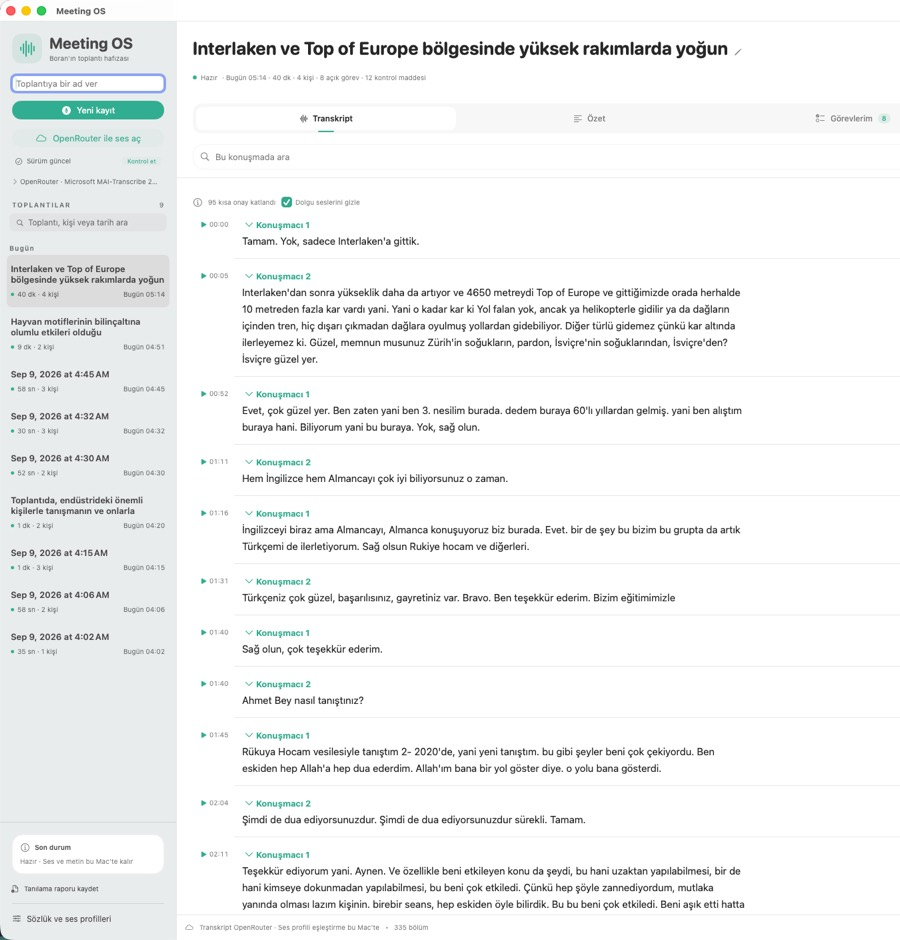

*Ana pencere. Sol: Yeni kayıt, sürüm satırı (Güncelleme ara), toplantı araması, tarih grupları; altta Son durum kartı, Ayarlar ve ⋯ menüsü. Sağ: başlık, özet şeridi (tarih · süre · kişi), sekmeler ve rozetler, konuşmada ara, İsimler kartı, okuma görünümü.*

Ekran görüntüleri 1.2.37 arayüzünden alınmıştır; yalnız panel, karne ve Ayarlar görselleri daha eski (etiketler metinde günceldir).

---

## 1. İlk kurulum

1. GitHub `borankaraduman-star/meeting-os` → v0.1 dalı. Yeni bir Mac ya da ekip arkadaşı: `git clone -b v0.1 … && sh scripts/install.sh`, adım adım [EKIP.md](EKIP.md). İkinci Mac için `docs/TWO_MAC_WORKFLOW.md`.
2. **Adınızı yazın — ilk kayıttan önce.** Açılış ekranında sorulur; atlarsanız Ayarlar (⌘,) → **Genel → Sizin adınız**. Mikrofonunuz ayrı bir ses akışıdır ve doğrudan bu adla etiketlenir (ses profili gerekmez), **Görevlerim → Bana ait** de bu ada göre süzer. Ad boşken mikrofon paragrafları “Ben” diye geçer ve “Bana ait” boş kalır. Bulut transkriptinde mikrofon paragrafları bu etiketle gelir (ayrı bir “ad” sütunu yoktur); “Bana ait”, karne, arama ve maskeleme bu etiketi de siz sayar, yani mikrofonda verdiğiniz sözler sahipsiz kalmaz. Ad boşken (“Ben”) o sözlerin sahibi yazılmaz — tahmin edilmez. Sonradan yazmak ya da düzeltmek serbesttir: adı kaydettiğinizde daha önceki toplantıların mikrofon paragrafları da yeni adı alır, **eski adla kaydedilmiş görevlerin sahibi de yeni ada taşınır** (elle düzenlediğiniz görevlere dokunulmaz), o toplantıların özeti “güncel değil” olur ve yenilenmesi yeniden ücretlendirilir (bölüm 11). Aynısı konuşmacı adlandırmada da geçerlidir: bir kümeyi yeniden adlandırınca o toplantının görevleri de yeni ada geçer.
3. Uygulamayı açın, **Ayarlar (⌘,) → Sistem → Kurulum durumu** kartına bakın: mikrofon, ekran kaydı (sistem sesi bununla alınır), bildirim, takvim, hatırlatıcı izinleri; OpenRouter anahtarı; sözlük; sürüm; teşhis rapor klasörü. Kırmızı madde: kayıt ya da güncelleme onsuz çalışmaz; **İzin iste** hiç sorulmamışsa macOS’a sordurur, **Ayarları aç** reddedilmiş izin için ilgili Sistem Ayarları bölmesini açar.
4. OpenRouter anahtarı **Ayarlar → Sistem → OpenRouter anahtarı** satırından girilir (ilk bulut işleminde de istenir). `scripts/install.sh` sırasında verildiyse zaten kayıtlıdır ve hiçbir Anahtar Zinciri penceresi çıkmaz: anahtar uygulamanın klasöründe yalnız size açık bir dosyada (`openrouter.key`, 0600) durur, yedeği Anahtar Zinciri’ndedir. Anahtarı bu dosya olmadan (daha önce kurulmuş bir Mac’te) devralırken macOS **bir kez** “Meeting OS anahtar zincirine erişmek istiyor” diye sorar — Ayarlar → Sistem ilk açıldığında ya da ilk işte; **Her Zaman İzin Ver** deyin, sonraki açılışlar ve güncellemeler Anahtar Zinciri’ne dokunmaz.
5. Sözlük: Slack agent çıktısı `glossary.jsonl` iCloud Drive `MeetingOS-Shared/` altında; bütün Mac’ler okur (bkz. bölüm 9).

## 2. Kayıt

| Nasıl | Nerede |
|---|---|
| **⌃⌥R** | Her yerden başlat/bitir (Zoom öndeyken de). |
| Menü çubuğu simgesi (dalga) | Kayıt başlat/bitir, süre, an işaretleri, “Son toplantıyı aç”, **Kontrol sekmesini aç**, güncelleme. |
| Kenar çubuğu → **Yeni kayıt** | Üstteki alana ad yazarsanız başlık o olur. |
| Zoom bildirimi | Zoom toplantı penceresi açılınca bildirim gelir; “Kaydı başlat” düğmesi vardır (Ayarlar → Genel). |
| Zoom’da elle dokunmadan (isteğe bağlı) | Ayarlar → Genel → “Zoom toplantı penceresi açılınca kaydı kendiliğinden başlat”: pencere 10 sn açık kalınca kayıt başlar. Pencere kapandıktan sonra **5 dakika** beklenir ve mikrofon hâlâ kullanımdaysa kayıt durdurulmaz (ekran paylaşımı ya da Space değişimi pencereyi dakikalarca gizleyebilir). Elle başlatılan kayıtlara dokunmaz. |

Kayıt sırasında:

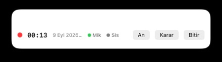

*Yüzen kayıt paneli: süre, toplantı adı, Mik/Sis sinyal noktaları, en az bir an işaretlendiyse ⌘M sayacı, An / Karar / Bitir. Her pencerenin üstünde durur, odağı almaz.*
- **Yüzen panel** her pencerenin üstünde: süre, toplantı adı, mikrofon/sistem sinyal noktaları (yeşil sinyal var, gri sessiz, turuncu eski okuma), en az bir an işaretlendiyse ⌘M sayacı, An / Karar / Bitir. Ayarlar → Genel’den kapatılabilir.
- **An işaretleri:** ⌃⌥M (her yerden) veya ⌘M önemli an, ⌘⇧M karar, ⌘⌥M bana görev, ⌘⌃M sonra bak. İşaretler kayıt bitince Kontrol sekmesinin üstünde ve ilgili paragrafın yanında görünür.
- Kayıt sürerken kenar çubuğunda **An · Karar · Görev · Sonra** düğmeleri çıkar; yüzen panelde yalnız **An** ve **Karar** vardır, Görev ve Sonra için kısayolu ya da kenar çubuğunu kullanın.
- **Takvim bağlamı (isteğe bağlı):** Ayarlar → Genel’de açıksa kayıt başlarken o andaki takvim etkinliğinin adı başlık olur, katılımcıları konuşmacı adlandırmada tek tıkla seçilir. Takvim yalnız okunur.
- Ekran uykusu engellenir; ses akışı koparsa (uyku/uyanma, ekran değişimi) ya da 20 sn ses gelmezse yardımcı akışı kendiliğinden yeniden kurar (3 deneme). Disk 3 GB altına inince uyarır, 400 MB altında durur.
- Kayıt sürerken yeni sürüm kurulmaz; toplantı sırasında başka iş varsa (önceki toplantının yüklemesi) arka plana alınır ve tek yükleyiciye iner.

Ses dosyası: kenar çubuğunda Ayarlar’ın yanındaki **⋯ → Ses dosyası aç…** bir dosyayı bulutta çevirip toplantı olarak ekler (aynı dosya ikinci kez seçilirse uyarır). Başlat düğmesi, “sesin seçili modelin sağlayıcısına gönderilmesini ve API ücretini kabul ediyorum” kutusu işaretlenmeden etkin olmaz.

## 3. Kayıt bitince (kendiliğinden)

1. Parçalar OpenRouter’a gider (MAI-Transcribe 2, konuşmacı ayrımıyla; ≈ $0,10/saat). Mikrofona hoparlörden düşen yankı yüklenmeden atlanır.
2. Konuşmacı kümeleri ses profilleriyle eşleştirilir (bu Mac’te, hafif). Eşleşen kişi adını alır; sınırda olanlar “Ad?” önerisi olarak Kontrol’e düşer.
3. Özet, kararlar, riskler, açık sorular ve görevler gpt-4.1-mini ile çıkarılır; her madde kaynak konuşmayla gelir, kaynağı doğrulanamayan alıntı atılır.
4. Başlık zaman damgasıysa ilk özet maddesinden ad verilir. Transkript ve özet bitince bildirim gelir (başka uygulama öndeyse).
5. Ses kayıpsız FLAC’e sıkıştırılır (41 dk ≈ 82 MB), ham parçalar silinir; teşhis raporu iCloud’a yazılır.

Bu adımlar sırasında Mac’te model yüklenmez ve bellek baskısı olsa da bulut işi durmaz; yalnız yerel model işleri durur.

**Bir şey ters giderse:**
- OpenRouter geçici hata verirse parçalar 2 / 8 / 20 sn arayla yeniden denenir; ödenmiş her parça kaydedilir, hiçbir şey iki kez yüklenmez.
- Anahtar geçersiz (401) ya da kredi bitmişse kenar çubuğunda tek satır görürsünüz (“Anahtar geçersiz · Ayarlar → Sistem → OpenRouter anahtarı”); ses silinmez. Sorunu giderince toplantı, Mac boştayken kendiliğinden yeniden alınır (10 dk → 30 dk → 2 sa → 6 sa → günlük); Ayarlar → Sistem’den kapatılabilir.
- Kayıt sırasında yardımcı süreç ölür ya da takılırsa aynı klasöre kaldığı saniyeden devam eder (saatte en çok 5 kez); uyku/uyanmada ses akışı yeniden kurulur. Panelde “Kayıt devam ediyor · N sn boşluk” görürsünüz; rapor `capture` bloğunda `relaunches`/`wakes` sayıları kalır.
- Yarıda kalan bir bulut işini toplantı başlığının altındaki **İşlemi sürdür** ile devam ettirebilir, süren bir yükleme/analizi kenar çubuğundaki **İşlemi iptal et** ile durdurabilirsiniz.
- Kayıt bittiğinde önceki toplantının işi sürüyorsa yeni toplantı kuyruğa girer; ⌃⌥R hiçbir zaman beklemez.
- Kayıt sürerken (Zoom, Meet ya da yüz yüze fark etmez) önceki toplantının yükleme/özet işi arka plan önceliğine iner ve tek parça yükler; kayıt bitince normal hıza döner. Bellek baskısında yalnız o iş durur, kayıt asla.

## 4. Kenar çubuğu

- **Yeni kayıt** (⌘R; her yerden ⌃⌥R) en üstte. **Toplantı adı alanı** yalnız işe yaradığı anda görünür: hiçbir toplantı seçili değilken sıradaki kaydı adlandırır, hâlâ “9 Eyl 2026 14:05” gibi bir zaman damgası adı taşıyan bir toplantı seçiliyken o toplantıyı yeniden adlandırır (⏎). Kayıt sürerken ya da bir iş dönerken gizlidir; adı her zaman başlıktaki kalem düğmesinden de değiştirebilirsiniz.
- **Sürüm satırı:** tek satır — “Sürüm 1.2.49 · güncel” ve mini **Güncelleme ara**; yeni sürüm varsa “Güncelle ve yeniden başlat” (Zoom açıkken “Güncelleme toplantı bitince”).
- **Toplantılar** Bugün / Dün / Bu hafta / Daha eski gruplarında; satırda “40 dk · 4 kişi” ya da “Konuşma bulunmadı” ve “Bugün 14:05” gibi saat.
- **Arama** başlık, tarih ve konuşmacı adında eşleşir.
- Sağ tık → **Toplantıyı sil…** (ses, transkript, rapor birlikte silinir; ses profilleri kalır).
- Altta **Son durum** kartı, sonra **Ayarlar** ve yanında **⋯** menüsü: **Ses dosyası aç…** ve **Tanılama raporu kaydet**.
- Yazıya çevirme modu ve model artık kenar çubuğunda değil: **Ayarlar → Sistem → Yazıya çevirme**.

## 5. Sekmeler (⌘1–⌘5)

### Transkript (⌘1)

*Transkript → Okuma: zaman ve ▶ solda, konuşmacı adı bir menü (▾), aynı kişinin ardışık paragrafları başlıksız sürer, sağda Düzelt. Üst bilgi satırında okuma görünümünde “95 kısa onay katlandı” (Bölümler görünümünde yalnız “Bulut transkript”, ayrıntı ipucunda) ve “Dolgu seslerini gizle”; sağda Okuma / Bölümler.*

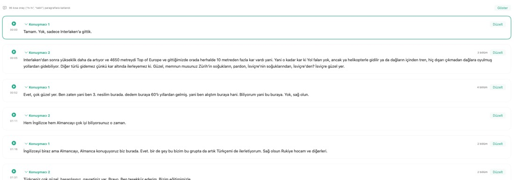

*Özet ya da Kontrol’den “Bölüme git” / bir alıntıya tıklayınca transkript o paragrafa kaydırılır ve 2,5 saniye yeşil çerçeveyle vurgulanır; çevresi görünür kalır.*
- **Okuma** görünümü belge gibidir: zaman solda, aynı kişinin ardışık paragrafları başlıksız sürer, konuşmacı değişiminde ayraç, dolgu sesleri (“eee”) gizli (kapatılabilir), kısa onaylar (“hı hı”) katlı. **Bölümler** ham kayıtları gösterir.

*İsimler kartı: transkriptin üstünde “İsimler · 4 kişi bekliyor”; her satırda ▶ dinle, isim alanı (yaz ve ⏎) ve takvim/profil menüsü. Öneri varsa “Ad” onayla düğmesi; birden çok öneri varsa “Hepsini onayla”. Sağ üstteki **Kontrol** düğmesi şüpheli bölümlerin tam listesine götürür.*
- **İsimler kartı**: isimsiz ya da öneri bekleyen her ses için tek satır. ▶ ile dinleyin, ismi yazıp ⏎’ye basın ya da menüden seçin; öneri varsa tek tıkla onaylayın. Adlandırma bütün kümeye uygulanır ve ses profili kaydedilir. Bütün isimler bitince bayat özet kendiliğinden yenilenir — bu **ücretli analizi bir kez daha çalıştırır** (≈1–3 cent, bölüm 11). Arka arkaya yaptığınız adlandırmalar tek yenilemede toplanır, her isim için ayrı ayrı ödemezsiniz. **Yalnız bu bölüm** düzeltmesi özeti yenilemez ve hiçbir ücret doğurmaz.
- **Geri al (⌘Z):** son adlandırmayı etiketleriyle ve öğrenilen ses örneğiyle birlikte geri alır (Son durum kartında “Geri al” düğmesi).
- Konuşmacı adına tıklayın → menü: ses profilleri, takvim katılımcıları, “Yeni isim…”. Seçim o kişinin bütün paragraflarını adlandırır ve profili kaydeder.
- **Konuşanı adlandır** tek alan, tek eylem: ismi yazın, “Adlandır ve öğren”. Metin düzeltme, temiz ses onayı (bu bölümden profil kaydeder) ve **Neden bu isim?** (tek cümle; puanlar ipucunda) **Gelişmiş** altındadır.
- Kümeyi profil kaydetmeden adlandırmak isterseniz **Yalnız bu toplantıda** düğmesini kullanın: isim bu toplantının bütün bölümlerine yazılır, ses profili oluşmaz.
- Konuşmacı doğru ama **tek bir cümle** başka birine aitse **Yalnız bu bölüm**: sadece o bölüm yeni adı alır, konuşmacının geri kalanı ve profili olduğu gibi kalır, kimse “yanlış” sayılmaz; bölüm en az 6 sn temiz konuşmaysa doğru kişinin profili ondan öğrenir. Paragraf birden çok bölümden oluşuyorsa hangi bölüm olduğunu üstteki menüden seçin. Sonraki küme adlandırmaları bu bölümü atlar.
- ▶ paragrafı dinletir; çalarken aynı düğme ■ olur ve durdurur, **⌘.** her yerden durdurur. **⌘F** bu konuşmada arar; Esc temizler.
- Mikrofon yankısı bölümleri gizlidir; üstteki satırdan gösterilebilir.

### Özet (⌘2)

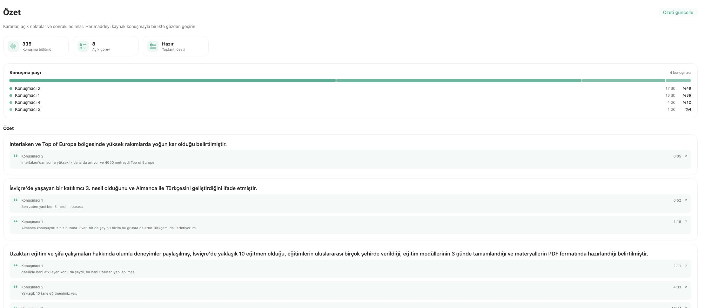

*Özet: bölüm / açık görev / özet durumu kartları, konuşma payı çubukları, ardından kaynak alıntılı özet maddeleri. Sağ üstte “Özeti güncelle”.*
- Konuşma bölümü / açık görev / özet durumu kartları, **konuşma payı** çubukları (yankı hariç).
- Özet, kararlar (önceki toplantıdaki hâliyle), riskler, açık sorular; her madde kaynak alıntısıyla. Alıntıya tıklayınca transkript o paragrafa kaydırılıp vurgulanır.
- Bir karar toplantının ilerleyen bölümünde geri alındıysa üstü çizili gösterilir ve altında “Toplantı içinde geri alındı; aşağıdaki karar geçerli.” yazar; madde silinmez, izlenebilirlik için kalır.
- **Özet ve görevleri hazırla / Özeti güncelle**: metin ya da isim değiştiyse “güncel değil” uyarısı çıkar.

### Görevlerim (⌘3)

*Görevlerim: filtre (Bana ait · Bu toplantı · Tüm görevler) ve sağda Dışa aktar menüsü (Brifing, gündem, gün/hafta özeti). Başlığın yanında durum rozeti yoktur; her satırda durum seçici, vade çipi ve ⋯ menü (Düzenle, **Hatırlatıcılar’a ekle**, Taslak hazırla, paket kaydet); altında kaynak alıntısı.*

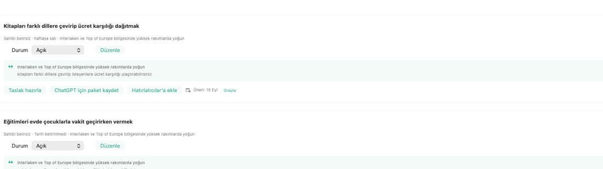

*Vade önerisi çipi: transkriptteki “haftaya salı” toplantı tarihine göre “Öneri: 15 Eyl” olur; Onayla’ya basmadan hiçbir yere yazılmaz.*
- Filtre: **Bana ait (n) · Bu toplantı (n) · Tüm görevler (n)**; listenin üstünde sabittir, kaydırmayla kaybolmaz. Seçim kalıcıdır: toplantı değiştirince de, uygulamayı yeniden açınca da yerinde kalır (varsayılan **Bana ait**). Sana atanmış görev yoksa filtre kendiliğinden değişmez; liste tek cümleyle nedenini söyler ve **Bu toplantı** bağlantısını sunar.
- Satırda: durum (Açık / Devam ediyor / Tamamlandı / Kaldırıldı), **vade çipi**, ⋯ menü (Düzenle, **Hatırlatıcılar’a ekle**, Taslak hazırla, ChatGPT/Codex/Claude Code için paket kaydet).
- **Vade önerisi:** transkriptteki “yarın / haftaya salı / ay sonu / 15 Eylül / 3 gün içinde” **toplantının yerel gününe** göre tarihe çevrilir (analizin kaydedildiği ana göre değil; gece yarısından sonra kaydedilen toplantılarda ikisi farklı günlere düşer), “Öneri: 15 Eyl · Onayla” olarak gelir; onaylamadan hiçbir yere yazılmaz. Onaylı tarih Hatırlatıcılar’a o gün 09:00 alarmıyla gider; geçmiş tarihli açık görev turuncu görünür.
- Önceki toplantıda benzer görev varsa gösterilir; **Aynı görev, eskisini kapat** ile bağlanır.
- **Dışa aktar** menüsü: **Brifing…** (sıradaki takvim toplantısının katılımcıları için verdikleri sözler, açık sorular, kararlar), **Sonraki toplantı gündemi…**, **Gün sonu özeti…** (**Verdiğin sözler** yalnız sana ait görevlerdir; **Cevapsız sorular** o günün bütün açık sorularıdır — başkasının sorduğu, yani cevabı senden beklenenler üstte), **Hafta özeti…** (son 7 gün, toplantı toplantı; CLI ile isim maskeli).

### Kontrol (⌘4)

*Kontrol: başlıkta madde sayısı ve **Sözlükle tara**’yı barındıran ⋯ menüsü; üstte “Son 7 gün · 18 madde” borç satırı (Tümünü göster), **Adlandırma isabeti** satırı ve altında **Öğrenme** satırı, sonra şüpheli maddeler; her maddede Bölüme git / Dinle / Adlandır…*

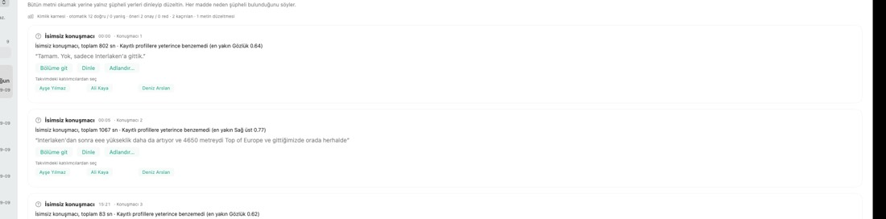

*Kontrol’de isimsiz konuşmacı: takvim bağlamı açıksa katılımcı çipleri gelir; tek tıkla adlandırır ve profil kaydeder.*

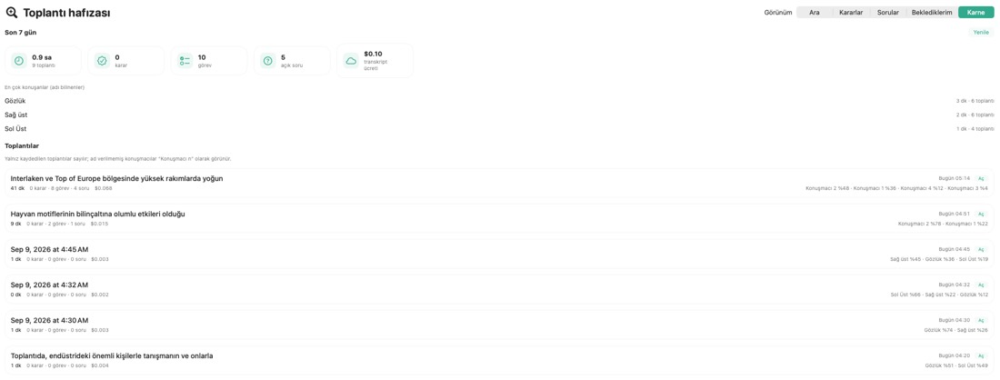

*Karne: varsayılan olarak kapalıdır, Kontrol → ⋯ → **Son 7 gün karnesi** ile açılır. Son 7 günün saati, kararı, görevi, sorusu, ücreti; toplantı başına konuşma payı yüzdeleri.*
- Şüpheli yerler sırayla: onay bekleyen isim (tek tık Onayla), isimsiz konuşmacı (takvim katılımcı çipleriyle adlandırma), çakışan konuşma, kısa sesle tanıma, sahibi belirsiz görev, sözlük düzeltmesi.
- Üstte **Son 7 gün · N madde** (bütün toplantıların kontrol borcu; “Aç” ilgili bölüme götürür). **Son 7 gün karnesi** varsayılan olarak kapalıdır; Kontrol başlığındaki ⋯ menüsünden açılır (toplantı saati, karar, görev, soru, ücret; toplantı başına konuşma payı). Karnedeki pencere de Kontrol borcuyla aynı yedi takvim günüdür. **Analiz ücreti** ayrı gösterilir; kaydı olmayan (eski ya da yerel modelle çıkarılmış) bir analizin ücreti “bilinmiyor” yazar, sıfır sayılmaz. Analiz edilmemiş toplantı “analiz yok” olarak geçer; sonradan geri alınmış kararlar karar sayısına girmez. Pencerede hiç toplantı yoksa karne bunu söyler.
- **Sözlükle tara** (Kontrol başlığındaki ⋯ menüsünde, “Son 7 gün karnesi” ve “Haftalık bakım” anahtarlarıyla birlikte) transkripti sözlükle karşılaştırır; öneriler analiz modeline doğrulatılır. **Doğrulananları uygula (N)** hepsini tek seferde işler, **Uygula** tek tek, **Yoksay** düşürür. Özgün metin ve düzeltme geçmişi korunur.
- **Adlandırma isabeti** satırı: otomatik doğru/yanlış, onaylanan/reddedilen öneri sayıları, kaçırılan, metin düzeltmesi. Hemen altındaki **Öğrenme** satırı bu haftanın kendiliğinden tanıma oranını önceki haftayla ve 1000 kelimedeki düzeltme sayısıyla karşılaştırır. İkisi de Kontrol’ün kökündedir, karne panelinin içinde değil.
- **Haftalık bakım** (aynı ⋯ menüsünden, varsayılan kapalı): ses profilleri ve örnek sayıları — bir örnek diğerlerine benzemiyorsa **Zayıf örneği sil**; öğrenilmiş metin kuralları ve her birini **Kapat** düğmesi; disk kullanımı; anahtar ya da kredi yüzünden bulutta bekleyen toplantılar.

### Hafıza (⌘5, ⌘⇧F)

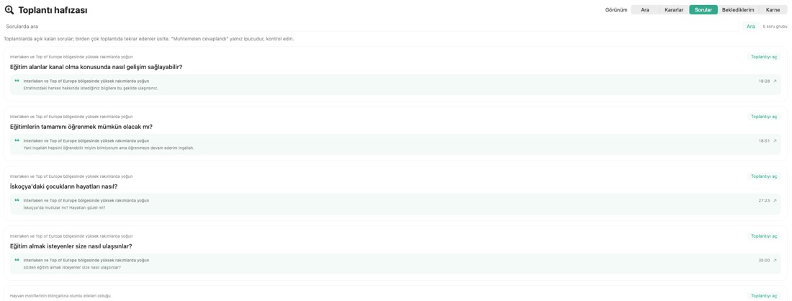

*Hafıza → Sorular: cevapsız sorular, hangi toplantıdan geldiği, kaynak alıntı ve “Toplantıyı aç”. Tekrar eden sorular turuncu “N toplantıdır” rozetiyle üstte.*
Tek arama alanı; bölüme göre çalışır:
- **Ara:** bütün tamamlanmış toplantılarda sözcük araması (Türkçe eklere dayanıklı: “modülleri” → “modülü”). **Kayıtlardan yanıtla** en fazla 12 alıntıyla kaynaklı yanıt üretir; yeterli kaynak yoksa kaçınır.
- **Kararlar:** **analiz edilmiş** toplantıların kararları tek listede, kaynak ve önceki hâliyle; **Markdown…** dışa aktarır. Toplantının kendi içinde geri aldığı bir karar listeden silinmez, **“(geri alındı)”** etiketiyle durur ve yürürlükteki karar sayısına girmez; analizi güncel olmayan toplantılar başlıkta ayrıca sayılır.
- **Sorular:** cevapsız kalan sorular, tekrar edenler üstte, “muhtemelen cevaplandı” ipucuyla (kontrol edin, kendiliğinden kapanmaz).
- **Beklediklerim:** başkalarının verdiği açık sözler kişiye göre, yaşı ve tekrar sayısıyla; **Hatırlatma metnini kopyala** kibar bir hatırlatma yazısı verir. Kişi eşleşmesi ada göredir (İ/I/ı ve büyük-küçük harf farkı önemsizdir, bir ad başka bir adın içinde geçtiği için eşleşmez); birini yeniden adlandırdığınızda görevleri de yeni ada taşınır.

## 6. Dışa aktar (başlık sağı)
Özet ve görevler (Markdown), Transkript (Markdown), Altyazı (SRT), JSON; **Belge hazırla:** PRD, hata raporu, müşteri talebi, Claude Code istemi (bilinen/eksik ayrımı, kaynak bölümler, kaynakta olmayan sayı reddedilir); **Paylaş…** önizleme + **İsimleri maskele** (Kişi A, Kişi B…; mikrofon etiketi ve Ayarlar’daki adınızla birlikte **kendi adınız da** maskelenir) + yalnız kararlar seçeneği.

## 7. Ayarlar (⌘,)

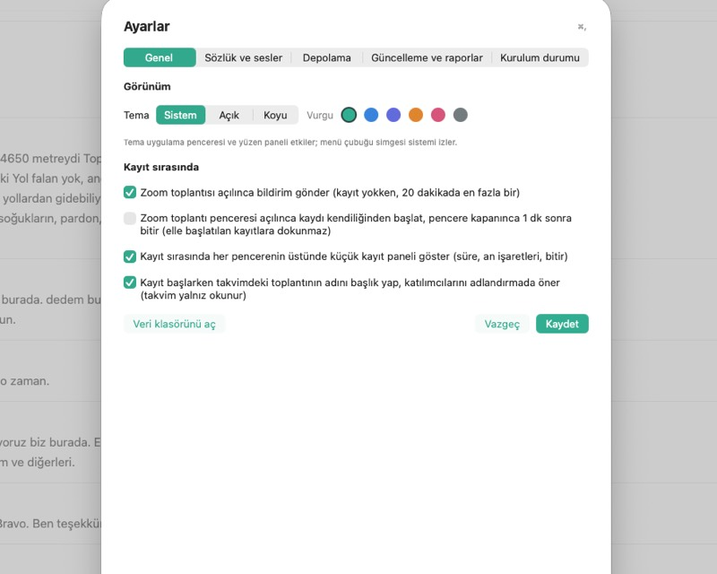

*Ayarlar (⌘,): üstte üç bölüm (Genel · Sesler ve sözlük · Sistem). Sesler ve sözlük: kişi kartları, sözlük, proje sözlüğü, ekip klasörü.*

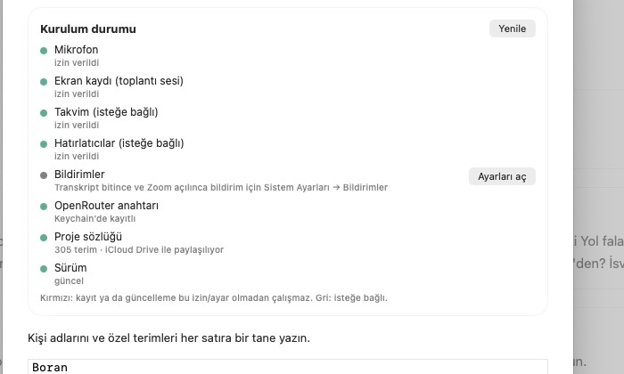

*Kurulum durumu kartı (Ayarlar → Sistem): her satırda izin/ayar durumu; eksik olanda “İzin iste” ya da “Ayarları aç”. Öz-test düğmesi ve sonucu ile uygulama yoklama gecikmesi Gelişmiş katında.*

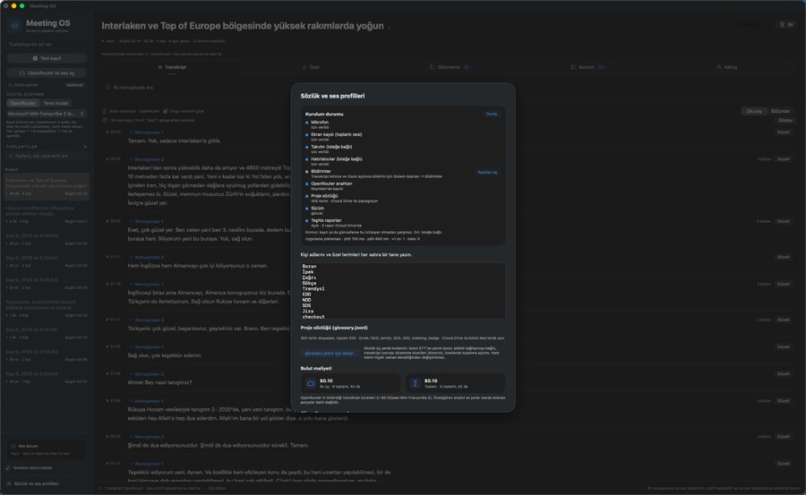

*Koyu tema ve mavi vurgu seçili hâli; yüzen panel de temayı izler.*

- **Genel — siz ve kayıt anı:** adınız (“Bana ait” filtresi ve mikrofon etiketi bu adı kullanır); tema (Sistem / Açık / Koyu) ve vurgu rengi; Zoom bildirimi; Zoom’da kendiliğinden kayıt; yüzen kayıt paneli; takvim bağlamı.
- **Sesler ve sözlük — kim konuşuyor, sözcükler nasıl yazılıyor:** kayıtlı ses profilleri (örnekleri dinleme/silme, yeniden adlandırma, profil silme); sözlük (kişi adları / özel terimler, satır başına bir; **Sözlüğü kaydet**), `glossary.jsonl` içe aktarma; ekip klasörü ve **Sözlüğü ekip klasörüyle paylaş**.
- **Sistem — makinenin kendi kendine yaptıkları:** **Yazıya çevirme** modu ve model (OpenRouter / Yerel; eskiden kenar çubuğundaydı); **OpenRouter anahtarı**; **Depolama** (toplam kullanım, en büyük toplantılar, **Sesleri sıkıştır**); bulut maliyeti (bu ay / toplam); **Güncelleme ve raporlar** (Şimdi kontrol et); **Kurulum durumu** (izinler, anahtar, sözlük, sürüm, rapor klasörü). Seyrek kullanılanlar **Gelişmiş** katında: **Eski toplantıların sesi** silinmesin / 14 / 30 / 60 / 90 gün sonra ve önizlemeli **Eski sesleri temizle**, açılışta kendiliğinden güncelle, bulut hatasında boşta yeniden dene, her toplantıdan sonra teşhis raporu, raporlara transkript ekleme, rapor klasörü, **Öz-test**, uygulama yoklama gecikmesi p50/p95.
- Ayarlar penceresinin altında her bölümde **Veri klasörünü aç** vardır. Gelişmiş katında ayrıca **Rapor klasörünü aç** ve seçili toplantıyı otomatik temizlikten muaf tutan **Seçili toplantının sesini koru** anahtarı bulunur.

**Ses saklama — tam olarak ne silinir.** **Eski toplantıların sesi** (varsayılan **30 gün sonra**) yalnız *ses dosyalarını* siler: o toplantının `recordings/` ya da `imports/` klasörü (birleştirilmiş `*-flac`/`*.wav` kaydı ve varsa kalan ham parçalar) tümüyle kaldırılır. **Kalanlar:** transkript (düzeltmeleriniz dâhil), özet, kararlar, sorular, riskler, görevler ve taslaklar, ses profilleri ve öğrenilmiş örnekler, teşhis raporları, toplantı başlığı ve tarihi. **Kaybolanlar:** o toplantının içindeki ▶ ile dinleme ve o toplantıdan alınmış profil örneğini dinleme (profilin kendisi kalır), sesin yeniden yazıya çevrilmesi ve konuşmacıların sesten yeniden tanınması. Temizlik saatte bir, yalnız kayıt yokken çalışır; tamamlanmamış toplantılara, bulutta hata almış olanlara ve **Sesi koru** işaretlilere hiç dokunmaz. Tek bir süre bütün kayıtlar için geçerli olduğundan bir haftanın kayıtları aynı gün gider: en eski kaydın sesi silinmeye üç gün kala Son durum satırında “N kaydın sesi 3 gün içinde silinecek” uyarısı çıkar — o toplantıyı saklamak için **Sesi koru**’yu açın ya da süreyi Ayarlar → Sistem → Gelişmiş’ten değiştirin.

## 8. Ses profilleri (kişi tanıma)
Bir kişiyi bir kez adlandırın (İsimler kartında, konuşmacı menüsünden ya da Düzelt ile); profil kaydedilir ve sonraki toplantılarda aynı kişi kendiliğinden tanınır. Sınırda eşleşmeler “Ad?” önerisi olur.

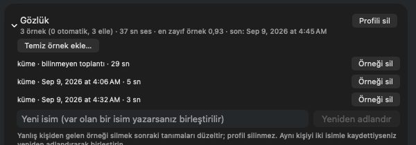

*Kişi kartı (Ayarlar → Sesler ve sözlük): örnek sayısı, süre, en zayıf örnek, son toplantı; “Temiz örnek ekle…”, örnek silme ve yeniden adlandırma.*

**Öğrenme döngüsü:**
- Yanlış otomatik ismi düzelttiğinizde o kümenin yanlış kişiye beslediği ses örneği silinir ve bu ses o kişi için “reddedildi” olarak hatırlanır; bir daha ona eşleşmez.
- Aynı kelimeyi iki farklı toplantıda aynı şekilde düzelttiyseniz bu bir kural olur: sonraki transkriptlerde kendiliğinden uygulanır, paragraf işaretlenir ve geri alınabilir (geri alma kuralı kapatır). Sözlükteki bir terime denk gelen kurallar yanlış-duyma önerisi olarak sunulur.
- Bir kümeyi adlandırdığınız anda aynı toplantının diğer isimsiz sesleri yeniden puanlanır (“· 2 kişi daha önerildi”). Kişi bazlı eşik: bir kişi için onayladığınız her öneri o kişinin eşiğini 0,01 düşürür (en az 0,84), yanlış otomatik isim 0,02 yükseltir; küresel eşik değişmez.
- Kontrol’de **Adlandırma isabeti** satırının hemen altındaki **Öğrenme** satırı bu haftanın kendiliğinden tanıma oranını ve 1000 kelimede düzeltme sayısını geçen haftayla karşılaştırır. Birkaç hafta düzenli düzeltmeyle oran yükselmelidir; yükselmiyorsa `quality replay` çıktısını inceleyin. Aynı adda farklı kişiler için ayırt edici ad kullanın (“Ali Tasarım”). Mikrofon kaynağı Ayarlar → Genel → Adınız değeriyle etiketlenir.

## 9. Sözlük
`iCloud Drive/MeetingOS-Shared/glossary.jsonl` (her satır `{"term": …, "expansion": …, "category": …}`); `~/Library/Application Support/MeetingOS/glossary.jsonl` Mac’e özel ek. Ayarlar → Sesler ve sözlük → **Sözlük** kutusundaki basit terim listesi aynı klasörde `vocabulary.txt` olarak tutulur (depodaki dosya yalnız ilk açılışta kopyalanan başlangıç listesidir). Üç yerde kullanılır: bulut STT’ye yazım ipucu (prompt kabul eden modellerde), transkript sonrası düzeltme önerileri (Kontrol), özetlerde kısaltma açılımı. Ham transkript kendiliğinden değişmez. Slack agent istemi: `docs/GLOSSARY.md`.

**Ekip klasörü** (Ayarlar → Sesler ve sözlük → Ekip klasörü): iCloud tek Apple Kimliğine bağlı olduğundan ekip için ortak bir klasör (paylaşılan disk, Drive, Dropbox) seçilir. Sözlük okunurken yerel dosya → iCloud → ekip dosyası sırasıyla bakılır, terimi ilk tanımlayan kazanır; içe aktarma ekip dosyasını **birleştirerek** yazar (önce yeniden okur, geçici dosyaya yazıp yerine taşır), böylece aynı anda yazan başka bir Mac’in terimleri silinmez. Ekip klasörü doluyken teşhis raporları da kişisel klasör yerine `<ekip klasörü>/reports/<mac-adı>/` altına yazılır. Ses, transkript ve ses profilleri bu klasöre girmez.

## 10. İki Mac ve güncelleme
Geliştirme bu Mac’te, kullanım diğer Mac’te. Diğer Mac toplantı yokken kenar çubuğundan **Güncelle ve yeniden başlat** ile v0.1 dalının son hâlini kurar (derleme düşük öncelikte; Zoom açıkken yapılmaz). Her tamamlanan toplantıdan sonra iCloud `MeetingOS-Reports/<Mac adı>/` altına sayısal rapor (maliyet, kaç parça, kimlik karnesi, işin CPU/bellek/süresi, yakalama sağlığı) ve saatte bir `heartbeat.json` (disk, bellek baskısı, termal, yük, son hatalar) yazılır. Transkript metni yalnız ayar açıkken rapora girer.

## 11. Maliyet
OpenRouter yalnız yükleme başına ücretlendirir: MAI-Transcribe 2 ≈ **$0,10/saat**; özet/görev analizi (`openai/gpt-4.1-mini`) **her çalıştığında ≈1–3 cent**. Analiz bir toplantıda birden çok kez çalışabilir: isim verme ya da metin düzeltme transkripti değiştirir, özet bayatlar ve yenilenirken yeniden ücretlendirilir. Ayarlar → Sistem → **Bulut maliyeti** gerçek faturayı gösterir — yazıya çevirme ve analiz ayrı satırlarda, toplam ve toplantı başına.

## 12. Klavye kısayolları
Her yerden: ⌃⌥R kayıt, ⌃⌥M an. Uygulamada: ⌘1–⌘5 sekmeler, ⌘F konuşmada ara, ⌘⇧F hafızada ara, ⌘Z son adlandırmayı geri al, **⌘. dinlemeyi durdur**, ⌘, Ayarlar, Esc aramayı temizle; kayıt sırasında ⌘M / ⌘⇧M / ⌘⌥M / ⌘⌃M işaretler.

## 13. CLI (`.venv/bin/python -m meeting_os …`)
`openrouter-import dosya --no-local`, `openrouter-finalize <toplantı>`, `analyze <toplantı> --openrouter-model openai/gpt-4.1-mini`, `prepare`, `quality report|compare`, `agenda --output gundem.md`, `digest [--from --to --mask-names] --output`, `waiting`, `decisions [--query]`, `questions [--query]`, `scorecard [--from --to]`, `review-debt --days 7`, `share`, `glossary import|show|suggest|hint`, `reports summarize|heartbeat`, `probe [--network]` (öz-test: kayıt yardımcısı, ffmpeg, ses modeli, veritabanı, disk, anahtar, sözlük, rapor klasörü), `quality replay` (kimlik/metin regresyonu), `update check|start|status`, `document`.

## 14. Sınırlar ve dürüst notlar
- Canlı (kayıt sırasında) metin yoktur; her şey kayıt bitince gelir.
- Arama sözcük tabanlıdır; anlamca benzer ifadeleri her zaman bulmaz.
- Görev sahipliği isimlerin doğruluğuna bağlıdır; belirsiz sahip boş bırakılır.
- Vade önerisi ve “muhtemelen cevaplandı” yalnız öneridir; onay gerektirir.
- Zoom’da kendiliğinden kayıt ve uyku senaryosu birim testlidir, canlı Zoom ile henüz denenmemiştir.
