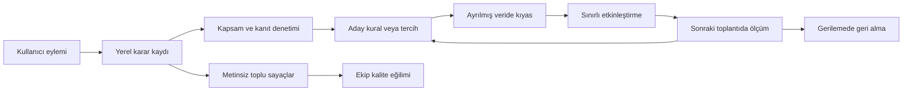

# Meeting OS: kullanımından öğrenen ürün tasarımı

**Önerim: mevcut kişi ve kelime öğrenmesini, “kullanıcı kararı → yerel kanıt → aday iyileştirme → bağımsız ölçüm → sınırlı uygulama → geri alma” döngüsüne tamamlayın.** İlk yatırım yeni modele değil, doğru geri bildirimi kaybetmemeye ve iyileşmeyi dürüst ölçmeye gitmeli.

`v0.1` dalını ve `1.2.79` sürümünü dosyalardan doğruladım. İstenen belgeleri, checkpoint’in son 200 satırını ve ilgili kod yollarını okudum. Kod değiştirmedim; test, uygulama, kıyas veya ağ isteği çalıştırmadım. Aşağıdaki yüzdeler **önerilen kabul hedefleri**, mevcut ölçülmüş sonuçlar değildir.

## Önce üç ayrım

**1. Uygulama bugün gerçekten öğreniyor; model ağırlıkları değişmiyor.** Kişi örnekleri, ret vektörleri, kişisel eşikler, kelime kuralları ve sözlük büyüyor. Özet/görev tarafında ise kullanıcı düzeltmelerini sonraki çıkarımlara taşıyan benzer bir döngü yok.

**2. Her kullanım sinyali kalite etiketi değildir.**

| Sinyal | Güvenle çıkarılabilecek anlam |
|---|---|
| “Bu isim doğru”, yanlış adı düzeltme | İlgili kimlik tahmini hakkında açık karar |
| Bir kelimeyi öğretme | Belirli yazım dönüşümüne açık talimat |
| Özet maddesini düzeltme | İçerik veya anlatım tercihi; ikisini ayırmak gerekir |
| Görev sahibini/tarihini değiştirme | Model düzeltmesi **veya** toplantı sonrası iş değişikliği |
| Dışa aktarma | Çıktının kullanıldığı; bütün maddelerin doğru olduğu değil |
| Dokunmama | Bilinmiyor; onay sayılmaz |
| Ekibe katılma | Kurulum aşaması; ekip bilgisinden yararlanıldığının kanıtı değil |

**3. Gizlilik hedefi ile mevcut ürünün veri akışı aynı cümleyle anlatılamıyor.** Belgeler mevcut bulut modunda sesin STT için, transkriptin analiz için OpenRouter’a gönderildiğini açıkça söylüyor. “Mac’te kalır” burada dışarıda hiç işlenmez anlamına gelmiyor. Ayrıca `share_text` açıkken ekip raporu transkript taşıyabiliyor. [KULLANIM.md:3](docs/KULLANIM.md:3), [EKIP.md:23](docs/EKIP.md:23)

Bu raporda önerdiğim öğrenme katmanı için sınır şu: **yeni ses/transkript aktarımı yok; gerçek düzeltme örnekleri yerelde; ekibe yalnız izinli bilgi nesneleri ve metinsiz toplu ölçümler.** “Ses ve transkript hiçbir sağlayıcıya da gitmesin” hedefi ayrıca mevcut çıkarım mimarisinin değiştirilmesini gerektirir.

## Önerilen döngü

Yerel kurallar ve sınırlı kişiselleştirme, bu aşamada en uygun yol. Her Mac’te model eğitimi eklemek kaynak maliyetini büyütür; merkezi eğitim verisi toplamak ise istenen gizlilik kapsamını aşar.

Ortak ölçüm kuralları:

- İlk sürüm **başlangıç düzeyini B olarak ölçsün**. Örneğin “%60 → %80” gibi uydurma başlangıçlar kullanılmasın.
- Oranlar pay/payda ve incelenen kapsamla birlikte raporlansın. Boş payda `null` olsun.
- Kıyas, öğrenmede kullanılmamış toplantılarda yapılsın. Aynı toplantının düzeltmesiyle aynı toplantıda başarı ölçülmesin.
- Kalite artışı; hata, kullanıcı emeği, süre ve maliyet birlikte değerlendirilerek kabul edilsin.
- Az verili pilot sonuçları yön gösterir. Birkaç toplantıda sıfır hata, gerçek hata oranının <%1 olduğunu kanıtlamaz.

## Öncelikli 12 iterasyon

### 1. P0 — Kullanıcı kararlarını ortak, güvenilir bir ölçüm kaydına bağlayın

**Sinyal ve bugünkü kayıt:** Kayıt/toplantı durumu, isim ve metin düzeltmeleri saklanıyor. Fakat “Düzelt ve öğret” doğrudan segment payload’ını değiştiriyor; `text_edits` üzerinden yürümüyor. Dışa aktarma yolları dosya üretip dönüyor; ortak bir kullanım olayı yazmıyor. [correction_memory.py:376](meeting_os/correction_memory.py:376), [desktop.py:613](meeting_os/desktop.py:613)

**Bugün öğrenilen / kaçan:** Kelime öğreniliyor fakat `quality.reference_set` yalnız `text_edits` okuduğu için bu öğretme yolu kalite setine aynı şekilde girmiyor. Ayrıca `identity_report`, korunmuş otomatik adı kullanıcı onayı olmadan `auto_correct` sayabiliyor. [quality.py:39](meeting_os/quality.py:39), [quality.py:68](meeting_os/quality.py:68)

**En küçük değişiklik:** Mevcut tabloları değiştirmek yerine küçük bir yerel `learning_events` kaydı ekleyin: eylem, nesne/sürüm, kapsam, insan/otomasyon kaynağı, sonuç, geri alınan olay. İçerik gerekiyorsa mevcut yerel kayda referans versin. Kayıt başlatma/bitirme, öğretme, onay, ret, geri alma, dışa aktarma başarısı ve katılım aşamaları kapsansın. Önizleme dışa aktarma sayılmasın.

**Ölçüm / hedef:** Desteklenen her başarılı kullanıcı işlemi tam bir kez kayda geçsin; yeniden deneme çoğaltmasın. Otomatik isimler `doğrulandı / yanlışlandı / incelenmedi` ayrılsın. Kelime öğretme yollarının ölçüm kapsamı %100 olsun.

**Risk:** Otomatik uygulanan 20 kelimeyi 20 bağımsız insan onayı saymak. Bir insan kararı ve onun 20 etkisi ayrı tutulmalı.

**Bu maddenin yayın kapısı:** Yeni ölçümleri mevcut rapor nesnelerini kopyalayarak paylaşmayın. Beyaz listeli `errors` dışa aktarımı var; ancak nabız `errors.summary` üzerinden son iletileri, toplantı raporu `_errors` üzerinden hata satırlarını taşıyor. `_anonymous` bunları kaldırmıyor. Bu, gözlenmiş sızıntı değil, kapalı kabul edilen sözleşmede kalan ayrı bir kod yolu. Yeni ve mevcut tanılama yükleri ortak, alanları açıkça izinli bir şemadan üretilmeli. [reports.py:262](meeting_os/reports.py:262), [reports.py:495](meeting_os/reports.py:495), [team_cloud.py:762](meeting_os/team_cloud.py:762)

### 2. P0 — Özet maddesine düzeltme, kaldırma ve onay ekleyin

**Sinyal ve bugünkü kayıt:** Özet satırında kanıt açma ve metin seçme var. Madde düzenleme, kullanıcı tarafından kaldırma ve doğruluk onayı yolu görünmüyor. `Insight.id` metnin kendisi. [SummaryUX.swift:39](desktop/Sources/MeetingOS/SummaryUX.swift:39), [Intelligence.swift:10](desktop/Sources/MeetingOS/Intelligence.swift:10)

**Bugün öğrenilen / kaçan:** Analiz sürümleri saklanıyor; kullanıcının “yanlış”, “gereksiz”, “fazla kısa” değerlendirmesi yakalanmıyor. Dışarı aktarılan Markdown’da yaptığı düzeltme de uygulamaya dönmüyor.

**En küçük değişiklik:** Özet/karar/risk/soru maddelerine kalıcı kimlik ve küçük bir eylem menüsü: **Düzelt · Kaldır · Doğru**. Kaldırma nedeni isteğe bağlı olsun: yanlış içerik, tekrar, gereksiz ayrıntı. Kullanıcı değişikliği model çıktısının üzerinde ayrı bir katmanda tutulsun; yeniden analizde sessizce ezilmesin.

**Ölçüm / hedef:** Düzenleme ve kaldırma işlemlerinin %100’ü kaynak analizle eşleşsin; yeniden analiz sonrası kullanıcı değişikliği kaybı sıfır olsun. Başlangıç metriği: incelenmiş 100 maddede içerik düzeltmesi, tekrar kaldırması ve anlatım düzenlemesi.

**Risk:** “Kaldır”ı otomatik olarak “olgusal yanlış” saymak; farklı analizde benzer metne yanlış düzeltmeyi taşımak. Eşleme belirsizse otomatik aktarım yapılmamalı.

### 3. P0 — Görev geri bildirimindeki tarih ve neden boşluğunu kapatın

**Sinyal ve bugünkü kayıt:** Başlık, sahip, `due_text` ve durum değişiklikleri `task_edits` içine önceki hâl/değişiklik olarak yazılıyor. Ancak `set_due_date`, takvim tarihini değiştirip `user_edited=1` yapıyor; aynı geçmiş kaydını yazmıyor. [memory.py:178](meeting_os/memory.py:178), [memory.py:200](meeting_os/memory.py:200)

**Bugün öğrenilen / kaçan:** Kullanıcının düzenlediği alanlar korunuyor; sonraki sahip/tarih çıkarımı değişmiyor. “Model yanlış çıkardı” ile “iş sonradan devredildi/ertelendi” ayırt edilemiyor.

**En küçük değişiklik:** Takvim tarihi onaylama/değiştirme/temizleme de ortak geçmişe girsin. Tarihte önerilen ve seçilen değer; sahipte önceki ve sonraki değer yerelde tutulsun. Düzenleme menüsünde isteğe bağlı **“Çıkarım hatası / Sonradan değişti”** ayrımı olsun. Nedeni bilinmeyen değişiklik eğitim etiketi yapılmasın.

**Ölçüm / hedef:** Bütün görev alanı değişikliklerinde geçmiş kapsamı %100; kullanıcı tarafından onaylı tarih kaybı sıfır. Alan bazında düzeltme oranı ve nedeni bilinmeyen oran ayrı raporlansın.

**Risk:** Görevin tamamlanmasını model onayı saymak. Ayrıca görev kimliği başlık ve alıntıya bağlı olduğundan yeniden analiz yeni kimlik üretebiliyor; geçmiş bağlantısı yalnız kimlik eşitliğine bırakılmamalı. [memory.py:157](meeting_os/memory.py:157)

### 4. P0 — Kontrol kuyruğundaki kararları kapanan ve öğrenilebilen işlere dönüştürün

**Sinyal ve bugünkü kayıt:** İsim onayı ve kelimelerde “Bu doğru” mevcut. Kelime cevabı global `word_dismissals` tablosuna yazılıyor. Genel ASR/çakışma/kısa ses maddelerinin ortak karar kaydı yok. Kuyruk ayrıca sahibi dolu ama `needs_review=True` olan görevleri sırf bu nedenle getirmiyor. [review.py:11](meeting_os/review.py:11), [correction_memory.py:545](meeting_os/correction_memory.py:545)

**Bugün öğrenilen / kaçan:** Kelime yeniden sorulmuyor; fakat hangi önerici ne kadar gereksiz iş çıkarıyor ölçülmüyor. Özetin “kontrol” rozeti ile tamamlanabilir bir inceleme işi arasında bağlantı eksik.

**En küçük değişiklik:** Kuyruk öğesine kaynak sürümü ve `doğru / düzeltildi / geçildi` sonucu verin. Aynı sürümde çözülmüş madde yeniden gelmesin; kaynak değişirse yeniden değerlendirilsin. `needs_review` maddeleri de aynı mekanizmaya bağlansın.

**Ölçüm / hedef:** Çözülmüş aynı maddenin yeniden görünmesi sıfır; sonraki pilotta 60 dakikalık toplantı başına gereksiz Kontrol maddeleri B’ye göre **%25 azalsın**. Sabit zor vaka setinde yakalanan hata sayısı düşmesin.

**Risk:** Kuyruğu yalnız gizleyerek küçültmek. “Geç” onay değildir; tek bağlamdaki doğru yazım bütün bağlamlarda güvenli olmayabilir.

### 5. P1 — Kişisel eşikleri zaman sıralı kanıtla kalibre edin

**Sinyal ve bugünkü kayıt:** Öneri onayı ve yanlış otomatik isim kişi sayacına işleniyor. Onay eşiği 0,01 düşürüyor, yanlış eşleşme 0,02 yükseltiyor; her sayaç etkisi üç olayla sınırlı. Bulut eşikleri 0,87 / 0,05; öneri eşiği 0,83. [store.py:180](meeting_os/store.py:180), [cloud_finalize.py:617](meeting_os/cloud_finalize.py:617)

**Bugün öğrenilen / kaçan:** Kişiye özgü uyarlama zaten var. Ancak üç onaydan sonrası, farklı kayıt koşulları ve örneğin insan/otomasyon kaynağı eşik hesabında ayrışmıyor. `correct_segment_only` ret ve küme örneği onarımı yapıyor; mevcut docstring’in “ret yok” ifadesi kodla artık uyuşmuyor. [store.py:262](meeting_os/store.py:262)

**En küçük değişiklik:** İlk aşamada mevcut eşikleri koruyun; birkaç sınırlı eşik/marj adayını **yalnız önceki toplantılardan gelen, insan doğrulamalı kanıtla** sessizce puanlayın. Yeterli veri yoksa mevcut eşik kalsın. Bir yanlış otomatik isim, eşiği düşürmeyi durdursun.

**Ölçüm / hedef:** İkinci ve sonraki toplantılarda, doğrulanmış bilinen kişilerin doğru otomatik adlandırılma oranı **B +10 yüzde puan**; yanlış otomatik ad oranı artmasın. Bilinmeyen kişiye yanlış isim ve çekimserlik ayrıca ölçülsün.

**Risk:** Mevcut replay yalnız değerlendirilen toplantının katkısını çıkarıyor; gelecekteki toplantıların örneklerini kullanabiliyor ve isimli kümeleri değerlendiriyor. Bu yararlı regresyon kontrolüdür, gerçek cold start ölçümü değildir. Zaman sıralı değerlendirme ve bilinmeyen kişi vakaları şart. [quality.py:170](meeting_os/quality.py:170)

### 6. P1 — Ekip profillerine yerel güven verin; cold start’ı sonuçla ölçün

**Sinyal ve bugünkü kayıt:** Profilin kaynak host’u, modeli, vektörü ve süresi var. `team:` ve `auto:` örnekler tekrar yayımlanmıyor; ret vektörleri içe aktarımı süzüyor. Ancak tanıma skoru yerel ve ekip örneklerini aynı havuzda değerlendiriyor. [team_knowledge.py:264](meeting_os/team_knowledge.py:264), [store.py:639](meeting_os/store.py:639)

**Bugün öğrenilen / kaçan:** Ekip bilgisi ilk toplantıda yardımcı olabilir; fakat “8 profil indi” ile “iki kişiyi doğru tanıdı” birbirinden ayrılmıyor. Katılım sonucu ve eşitleme durumu var, ilk yarara ulaşma süresi yok. [team_cloud.py:448](meeting_os/team_cloud.py:448)

**En küçük değişiklik:** Kaynak sınıfını skorda görünür kılın: insan doğrulamalı yerel, ekipten gelen, otomatik yerel. Önce ekip örneğinin tek başına kazandırdığı/bozduğu eşleşmeleri ölçün; ardından sınırlı ağırlık veya daha yüksek kabul eşiği uygulayın. Ekip profili yeterince güvenli değilse isim önerisi sunsun.

**Ölçüm / hedef:** Katılım → bilgi kullanılabilir → ilk doğrulanmış yarar süreleri ayrı ölçülsün. Uygun çevrimiçi/boşta koşulda bilgi kullanılabilirliği p95 ≤60 sn; yeni kullanıcının ilk iki toplantısındaki elle adlandırma işi **%30 azalsın**, yanlış isim artmasın.

**Risk:** Bir cihazın hatasını bütün kişiye veya bütün ekibe mal etmek. İlk sürüm güveni **bu Mac’te, örnek/kaynak bazında** tutsun; ekip çapında kişi eşiği oylaması yapmasın.

### 7. P1 — Kelime öğrenimini STT hatasını gerçekten azaltacak biçimde sıralayın

**Sinyal ve bugünkü kayıt:** Açık öğretme bir defada kural oluşturuyor ve doğru yazımı sözlüğe ekliyor. Serbest metin düzeltmelerinden iki farklı toplantı ve %75 uyuşmayla kural çıkarılıyor. Ekip kelimeleri de STT ipucuna katılıyor. [correction_memory.py:53](meeting_os/correction_memory.py:53), [correction_memory.py:433](meeting_os/correction_memory.py:433)

**Bugün öğrenilen / kaçan:** Bu döngünün çoğu mevcut. Eksik olan, hangi kelimenin ipucuna gerçekten girdiği ve ham STT’de tekrar yanlış çıkıp çıkmadığı. İpucu 900 karakterde giriş sırasına göre kesiliyor. Ekipte çelişen kelimelerde en yeni kayıt kazanıyor. [glossary.py:173](meeting_os/glossary.py:173), [team_knowledge.py:183](meeting_os/team_knowledge.py:183)

**En küçük değişiklik:** Aynı 900 karakter içinde yakın zamanda düzeltilmiş, tekrar eden ve yerelde doğrulanmış terimleri öne alın. Çelişen ekip yazımlarını otomatik kazanan seçmek yerine öneriye indirin. Otomatik uygulamalar insan destek sayısını artırmasın.

**Ölçüm / hedef:** Ham STT’de aynı hata tekrar oranı **%20**, son metindeki tekrar düzeltme ihtiyacı **%30 azalsın**. İpucuna alınan/alınamayan terim sayısı, uygulama ve geri alma sayısı ayrı tutulsun. Mevcut metin replay’i yeni kuralın etkisini yeniden uygulayarak sınamıyor; eski/yeni kural sürümlerinin aynı sabit yerel örnekte karşılaştırılması eklenmeli. [quality.py:207](meeting_os/quality.py:207)

**Risk:** Türkçede yakın yazımları otomatik değiştirmek; sözcük sıklığını doğruluk sanmak. Exact-only koruması ve mevcut geri alma davranışı korunmalı.

### 8. P1 — Özet kişiselleştirmesini küçük tercihlerle başlatın

**Sinyal ve bugünkü kayıt:** Ayrıntılı özet seçimi kalıcı bir UI tercihi. Analiz istemi mevcut transkript ve sözlükten kuruluyor; geçmiş özet düzenlemeleri girdiye katılmıyor. Özet uzunluğu toplantı süresine göre hesaplanıyor. [Intelligence.swift:114](desktop/Sources/MeetingOS/Intelligence.swift:114), [intelligence.py:467](meeting_os/intelligence.py:467)

**Bugün öğrenilen / kaçan:** Kullanıcının görüntüleme tercihi hatırlanıyor; hangi tür ayrıntıyı sürekli geri eklediği veya hangi tekrarları sildiği öğrenilmiyor.

**En küçük değişiklik:** Önce üç sınırlı tercih: ayrıntı düzeyi, madde uzunluğu, tekrar birleştirme derecesi. En az üç ayrı toplantıdaki tutarlı **anlatım** düzeltmesinden aday tercih çıkarın. Olgusal düzeltmeler üslup tercihi sayılmasın.

**Ölçüm / hedef:** Ayrılmış toplantılarda 100 incelenmiş maddede anlatım düzenlemesi **%20 azalsın**; kaçırılan konu ve desteklenmeyen iddia oranı artmasın. Ek istem bütçesi en fazla 300 token, ek model çağrısı sıfır.

**Risk:** Gerçek düzeltmeleri few-shot olarak bulut istemine koymak onları Mac dışına çıkarır. Bulut için içeriksiz, sabit tercih şablonları kullanın. Gerçek örneklerle few-shot ancak yerel çıkarımda, en fazla birkaç örnekle ve kaynak toplantının saklama süresine bağlı olsun.

### 9. P1 — Görev düzeltmelerinden kişi ezberi yerine hata türü öğrenin

**Sinyal ve bugünkü kayıt:** Sahip/tarih düzeltmeleri mevcut; kaynak konuşmacı yeniden adlandırılınca elle düzenlenmemiş görevlerin sahibi taşınıyor. Analiz, açık ad veya birinci kişi taahhüdü arıyor; kanıtsız sahibi boşaltıyor. [memory.py:26](meeting_os/memory.py:26), [intelligence.py:195](meeting_os/intelligence.py:195)

**Bugün öğrenilen / kaçan:** Tek görevin doğruluğu korunuyor. Tekrarlayan “başkasının sözünü aktarma”, “koşullu söz”, “mikrofon/yankı”, “tarih yorumlama” hatalarının dağılımı sonraki çıkarımı etkilemiyor.

**En küçük değişiklik:** #3’te “çıkarım hatası” olarak ayrılmış değişiklikleri sabit hata sınıflarına yerelde ayırın. İlk uyarlama, sorunlu sınıfta daha fazla çekimserlik/inceleme olsun. Kişi adına bağlı “bu işi hep Ayşe yapar” kuralı üretmeyin.

**Ölçüm / hedef:** İncelenmiş görevlerde sahip düzeltmesi **%20 azalsın**; görev recall’ı en fazla 2 yüzde puan değişsin. Tarih doğruluğu, sahip doğruluğu, görev çıkarımı precision/recall’ı ayrı kalsın. Kıyas düzeneğinin `owner_mismatch` ve `due_mismatch` ayrımı kullanılabilir. [benchmark-analysis-cloud.py:103](scripts/benchmark-analysis-cloud.py:103)

**Risk:** Her şeyi sahipsiz bırakarak hata oranını düşürmek; toplantı sonrası devirleri model hatası sanmak. Kabul, hata oranıyla birlikte doldurma/yakalama oranına bağlı olmalı.

### 10. P2 — Nabzı ekip kalite eğilimine genişletin

**Sinyal ve bugünkü kayıt:** Nabız cihaz sağlığı, ekipten gelen/yayımlanan bilgi sayıları ve hataları taşıyor. Toplantı raporunda kuyruk türleri, analiz sayıları ve maliyet var. `alerts` ağırlıklı olarak operasyonel sorunları yakalıyor; kalite gerilemesini değil. [reports.py:366](meeting_os/reports.py:366), [reports.py:742](meeting_os/reports.py:742)

**Bugün öğrenilen / kaçan:** “Sistem çalışıyor mu?” görülüyor; “yeni sürümde daha çok isim mi düzeltiliyor?” görülmüyor. Her toplantı raporuna konan kimlik karnesi tüm DB’ye ait; raporları toplamak aynı gözlemleri tekrar sayabilir.

**En küçük değişiklik:** Yerelde günlük sayısal özet üretin: incelenen/yanlışlanan isimler, kelime tekrar hataları, özet/görev düzeltmeleri, çözülen kuyruk, başarılı dışa aktarımlar, analiz süresi. Paydaları da gönderin. Sayaçları cihaz+dönem+sürüm üzerinden **yerine koyarak** birleştirin; her eşitlemede eklemeyin.

**Ölçüm / hedef:** Yeterli örnekli iki ardışık dönemde hata oranı ≥%30 yükselirse tek alarm; tekrarlanan rapor sayımı sıfır. Ekipte “en çok düzeltilen” hata türleri gösterilsin. Kelime bazlı hesap yalnız zaten paylaşılmış kelime nesneleriyle yerelde ilişkilendirilsin; yeni toplantı metni veya kişi performans listesi çıkmasın.

**Risk:** Az kullanıcıda oranların oynaması, eski/yeni kullanıcı karışımı ve küçük grupların tanınabilirliği. En az 20 uygun gözlem olmadan kalite alarmı üretmeyin. Ekip varsayılanını alarm doğrudan değiştirmesin; aday değişiklik kıyasa girsin.

### 11. P2 — Sessiz kıyas ve geri alınabilir politika sürümleri ekleyin

**Sinyal ve bugünkü kayıt:** Analiz sürümleri ve kullanım maliyeti saklanıyor; aynı toplantıdaki iki alternatifin kullanıcı düzeltmesine göre eşleştirildiği deney kaydı yok. `quality.compare` ise açık izinle sesi yeniden buluta gönderiyor; gizli yerel kıyas sayılmaz. [assistant.py:12](meeting_os/assistant.py:12), [quality.py:92](meeting_os/quality.py:92)

**Bugün öğrenilen / kaçan:** Tek üretim sonucunun maliyeti biliniyor; değişikliğin faydasını aynı girdide ayırmak zor.

**En küçük değişiklik:** Önce ucuz adayları kıyaslayın: kişi eşiği, kelime sıralaması, kuyruk sıralaması. Model/istem kıyasında gerçek toplantı yerelde kalacaksa iki çıkarım da yerel olmalı. Bulut kıyası yalnız onaylanmış kurgu setinde yürüsün. Üretim dışı sonuçlar görev, profil veya kelime öğrenimine yazılmasın.

**Ölçüm / hedef:** Uygun toplantıların en fazla %10’u, cihaz başına günde en fazla bir deney. Öğrenme, deney ve nihai değerlendirme kümeleri ayrı olsun. Aday politika ancak önceden belirlenmiş kalite hedefi ve süre/maliyet sınırı birlikte tutarsa yükselsin; geri dönüş bir politika sürümü değişikliği olsun.

**Risk:** Görünmeyen alternatifteki maddeler için kullanıcının sessizliğini onay saymak. Kullanıcı yalnız gösterilen çıktıyı düzeltmiştir; eşleşmeyen alternatif maddeler puansız veya bağımsız incelemeli kalmalı.

### 12. P2 — Gerçek hatalardan kurgu regresyon seti üretin

**Sinyal ve bugünkü kayıt:** Mevcut kurgu seti olumsuzlama, koşullu söz, farklı vade, mikrofon sahibi ve sözlük enjeksiyonu gibi vakaları kapsıyor. Gerçek düzeltmeden bu sete giden sistematik yol yok. Betik ham model çıktısını da dosyaya yazıyor; `--fixtures` ile başka klasör kabul ediyor. [benchmark-analysis-cloud.py:167](scripts/benchmark-analysis-cloud.py:167)

**Bugün öğrenilen / kaçan:** Elle eklenen vakalar geliştiriciyi eğitiyor; kullanıcıdaki yeni hata sınıfları düzenli regresyona dönüşmüyor. En önemli ders belgede mevcut: kısa kurgu setinde başarılı model, gerçek uzun toplantıda başarısız oldu ve model kararı geri alındı. [BENCHMARK.md:215](docs/BENCHMARK.md:215)

**En küçük değişiklik:** Yerelde yalnız hata yapısını çıkarın: “aynı sahip, aynı görev adı, iki farklı tarih” gibi. Bundan tamamen yeni kişiler, konu, sayılar ve cümlelerle kurgu üretin. Yalnız isim maskeleme anonimleştirme sayılmasın. İnsan incelemesinden geçmiş kurgu seti bulut kıyasına kabul edilsin.

**Ölçüm / hedef:** İlk paket en az altı yeni vaka içersin; gerçek boyutta parça, çok parçalı uzun toplantı, konu kapsamı ve sonradan geri alınan karar kapsansın. Her aday en az üç tekrar koşulsun. Mevcut kapılara başarısız istekler, p95 süre, gerçek kullanılan model/fallback ve anlamsal inceleme eklensin.

**Risk:** Gerçek cümleyi biraz değiştirerek depoya veya `.raw.txt` çıktısına taşımak. Gerçek düzeltmelerin tamamını otomatik fixture’a çevirmeyin; olay yapısından yeni senaryo üretin. Sözcüksel kapıların geçmesi anlam doğruluğu değildir.

## Bütün sürümlere uygulanacak kaynak ve saklama sınırı

Bu katman ayrı bir veri platformuna dönüşmemeli:

- Kullanıcı işleminde yalnız küçük yerel kayıt; tüm geçmişi tarama, model çağrısı veya ağ bekleme yok.
- Ağır hesap yalnız kayıt yokken ve kaynaklar uygunsa. Kayıt başladığında deney işi durdurulur/ertelenir.
- Mevcut outbox genişletilsin; ikinci eşitleme kuyruğu kurulmasın. Sunucu dosya deposu olarak kalabilir. [team_cloud.py:527](meeting_os/team_cloud.py:527), [sync_server.py:44](server/sync_server.py:44)
- Yeni olay geçmişi için başlangıç sınırı **90 gün / 20 MB**; deney sonuçları için **7 gün / 20 MB**. Önce eski deneyler ve toplulaştırılmış olaylar budansın.
- Kaynak toplantı silinince ona ait metinli öğrenme örneği de silinsin. Öğrenilmiş kelime/profilin ayrı kalması mevcut ürün sözleşmesi; gerçek özet örnekleri bu istisnaya otomatik dahil edilmesin. [store.py:466](meeting_os/store.py:466)
- Yeni olay kaydının işlem gecikmesine katkısı p95 ≤10 ms hedeflensin. Aynı cihaz/senaryoda kayıt başlatma gecikmesi %5’ten fazla artmasın; ek ses boşluğu oluşmasın.

## YAPMA

- Öğrenmek için sesleri, transkriptleri, gerçek özet düzeltmelerini merkezi sunucuda toplama.
- Yerelde seçilmiş gerçek few-shot örneğini bulut istemine koyup “yerel öğrenme” diye sunma.
- Dışa aktarmayı, görevi tamamlamayı veya dokunmamayı doğruluk onayı sayma.
- Otomatik isimlerden üretilen örnekleri bağımsız insan kanıtı gibi sayma veya ekibe yayımla.
- Daha çok otomasyon için bütün kişi eşiklerini düşürme; yakın yazımları otomatik düzeltmeye geri dönme.
- Tek kişinin kelime reddini bütün ekipte yasak yapma; çoğunluğun yazımını yerel açık tercihin üstüne koyma.
- Kullanıcıya her toplantı sonunda puanlama anketi açma. Geri bildirimi mevcut işin içine yerleştir.
- Kayıt sırasında model kıyası, sürekli analiz veya geçmiş taraması çalıştırma.
- Kontrol kuyruğunu gizleyerek kaliteyi artırmış görünme.
- İnsanları konuşma süresi, görev sayısı veya düzeltme sayısıyla performans sıralamasına sokma.
- Küçük kurgu setini geçen modeli otomatik ekip varsayılanı yapma.
- “Anonim” etiketiyle serbest metin veya küçük grupları ele veren ayrıntılı telemetri paylaşma.

## Claude Code için uygulama sırası

Sürüm numaraları öneridir; her sürüm tek başına kullanılabilir ve geri alınabilir olmalı.

| Sürüm | Birlikte yapılacaklar | Kabul ölçütü |
|---|---|---|
| **1.2.80 — Güvenilir sinyal** | **#1 + #3** | Öğretme, isim kararı, görev alanları/takvim tarihi, katılım ve başarılı dışa aktarma tam bir kez kaydedilir. Dokunulmamış otomatik isim doğrulanmış sayılmaz. Tanılama yüklerinin tamamı izinli şemadan geçer; kurgu hassas metin yükte bulunmaz. |
| **1.2.81 — Kullanıcı kararının korunması** | **#2 + #4** | Özet düzeltme/kaldırma/onay ve genel Kontrol sonucu kalıcıdır. Yeniden analiz kullanıcı değişikliğini ezmez. Çözülmüş aynı madde yeniden çıkmaz; kaynak değişimi doğru ele alınır. |
| **1.2.82 — Tekrarlanabilir ölçüm** | **#10 + #12** | Başlangıç düzeyi pay/paydayla görünür. Aynı rapor iki kez sayılmaz. Gerçek boyutta kurgu seti ve zaman sıralı kimlik değerlendirmesi hazırdır. Bu sürüm model/eşik değiştirmez. |
| **1.2.83 — Kişi tanıma** | **#5 + #6** | Zaman sıralı pilotta doğru otomatik adlandırma hedefi sağlanır; yanlış isim artmaz. Yeni cihaz, kaynak düzeltmesi, geri alma ve çevrimdışı dönüş iki gerçek Mac’te doğrulanır. Veri yetersizse aday etkinleşmez. |
| **1.2.84 — Tekrarlayan kelime hataları** | **#7** | Aynı ipucu bütçesinde ham hata tekrarı ve kullanıcı düzeltmesi azalır. Türkçe ekler, doğru komşu kelimeler, ekip çatışması ve geri alma regresyonları geçer. |
| **1.2.85 — Deney ve geri dönüş** | **#11** | Deney sonucu üretim verisine karışmaz. Kayıtta çalışmaz; disk/iş bütçesine uyar. Politika sürümü geri alınabilir; gerçek içerik yeni bir dış aktarım yoluna girmez. |
| **1.2.86 — Özet ve görev uyarlaması** | **#8 + #9** | Ayrılmış veride düzenleme yükü azalır; konu/görev yakalama ve kanıt doğruluğu korunur. Few-shot gizlilik sınırı ve çıkarım hatası/sonradan değişiklik ayrımı doğrulanır. |

Önceki incelemenin kapanmış maddelerini yeniden projeleştirmiyorum. **P0 #7’deki alıcı ekranından canlı paylaşım doğrulaması ayrı dağıtım kapısı olarak kalmalı.** Bu öğrenme çalışmasının başarı cümlesi ise somut olmalı: **“Aynı ekip, sonraki toplantılarda daha az düzeltme yapıyor; yanlış kesinlik artmıyor; kayıt hızı, disk bütçesi ve paylaşım sınırı korunuyor.”**